# 2025 H2 Global Economic Outlook (I) - US and China

*Date: 2025-06-20*

2025 年6 月20 日

2025 H2 Global Economic Outlook (I) - US and China

US Summary

As wildfires rage across blocks of Los Angeles, the first half of US economic story has ended in disarray marked by
intensifying headwinds. Even now many investors remain rattled by persistent tariff uncertainties, an increasingly
unsustainable fiscal trajectory with no apparent ceiling on government spending, and a volatile messy executive
branch drifting further from any notion of policy consistency.

While a growing number of investors have walked away from the US Exceptionalism thesis they embraced at the
start of 2025, we believe that view may be premature. A closer read of both soft and hard data, alongside a still
resilient private sector, suggests that the US remains a compelling – perhaps unavoidable – destination for capital
in the second half of the game.

Policy Speculation

Although we now have a president seemingly addicted to showcasing his “art of the deal” in the white house, the
structural self-correction mechanism remains intact and functional. Most of the policies which might bring
devastation has been either neutralized by secondary market forces or quietly reshaped under the stewardship of
Treasury Secretary Bessant. One trait that does serve Trump well: he is capable of recognizing when a policy
backfires and pivoting swiftly if deemed necessary.

The very lesson we learned from the H1 chaos is that Trump ultimately cares about two things: the value of the
equity market as a proxy for TRUMP wealth and his political legacy (especially through his influence over GOP
beyond his presidency post-2028). Both objectives hinge heavily now on the outcome of the upcoming midterm
elections. From this point forward, his policy agenda will likely center on reinforcing these two pillars of legacy.

The top priority will be to pass the tax cut package. If paired with a moderation in inflation, a stable economy
landscape, and continued equity market strength, this would benefit both US households (the votes for GOP) and
the Trump family itself.

We also believe there are several areas the administration may begin to quietly walk away from, as they offer
limited strategic upside:

1. Tariffs Retreating: these offer minimal fiscal benefit and serve more as rhetorical fuel for his base (red
necks) than actual economic drivers

2. Policy Pivot on Deficits: rather than trying to reduce long-term deficits through tariffs or austerity, the
administration seems inclined to “RUN IT HOT” — in other words, aim for nominal GDP growth that
consistently outpaces debt accumulation. In that context, any progress on controlling debts (e.g., DOGE
Out, Government spending cut) may be de-prioritized or quietly shelved.

3. Bringing manufacturing back to the US: remains a symbolic pillar of Trump’s narrative. However, this is a
multi-year endeavour and may ultimately be sacrificed at the altar of short-term political calculus heading
into the 2026 midterms.

Soft/Hard Print & Fed

As previously noted, Trump responded quickly to the sharp decline in financial markets by adjusting his policy
stance. Based on our observations, there is a high chance that he will extend the reciprocal tariff policy again on 8
July 2025. While he has walked back several economically irrational policies, tariffs would still weigh on US
economy.

Tariff Is Not Gone, Source: Bloomberg

As products imported from China or Vietnam become more expensive, large retailers — whether traditional
supermarket giant like Walmart or platforms like Amazon — will be forced to pass these additional costs on to
consumers in order to preserve their profit margins. In turn, this would put pressure on millions of U.S.
households. We expect soft data indicators such as consumer sentiment and PMIs to reflect this burden fairly
quickly. Over time, these pressures are also likely to show up in hard data as the effects ripple through the broader
economy.

Indeed, the macro data already shows early signs of a modest slowdown. Looking at non-farm payrolls from a
trend perspective, the average monthly payroll gain in 2025 stands at 124,000, a notable decline from 173,700 in
2024, 216,200 in 2023, and 355,000 in 2022. This points to a structural deceleration in labor market momentum.
Meanwhile, CPI has remained below 2.5% since March (though it does not yet reflect the impact of potential
tariffs), supported in part by Trump’s aggressive energy policy — “drill baby drill” — which has helped bring down
oil prices. Q1 GDP came in at -0.2%, confirming a shallow contraction. The good news is that successful
negotiations with the UK and China have significantly reduced the likelihood of the US entering a severe
stagflationary or recessionary environment.

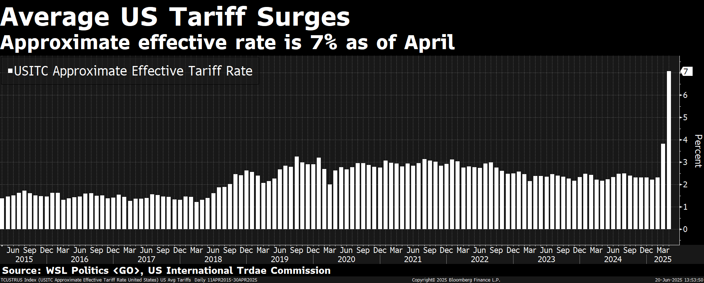

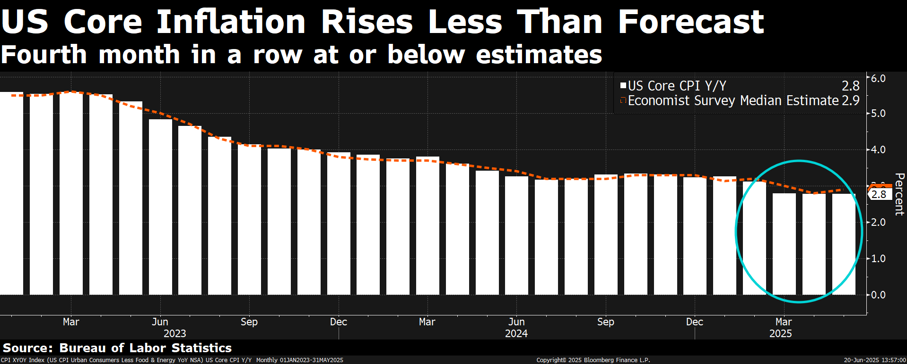

Despite all these, we remain cautious on the pace of rate cuts. While headline inflation is trending toward the 2%
target, the full effect of tariff policy has not yet been priced in. It is reasonable for Chair Powell and the Fed to wait
for further clarity in the data before initiating cuts again. In addition, US private sector and latest corporate
earnings have shown resilience, which gives the Fed little urgency to ease prematurely. A premature cut could
expose the central bank to credibility and risk management concerns, especially if the second-half inflation picture
turns out to be stickier than expected. Given the current elevated level of US rates, they have ample room to cut
when the real crisis comes. Therefore, even Trump called the rate cut again and again, we do not see any reason
from Fed’s perspective to cut when tariff did not come in and economy still remains resilient in the summer.

Another important risk to monitor is Powell’s term and the emerging succession dynamic. With Powell set to retire
in May 2026, President Trump may attempt to pre-emptively designate a “shadow” successor to undermine
Powell’s authority in advance. While such a move would carry no formal legal power, it could introduce an
additional layer of political volatility and raise questions about the independence of the Federal Reserve.

The rationale behind Trump’s desired rate cuts seems to have evolved. It is less about reducing the government’s
interest burden on Treasuries, and more about stimulating nominal GDP growth to support equity markets, boost
household wealth, and set the stage for a strong showing in the 2026 midterm elections. By contrast, Powell
remains focused on preserving the Fed’s institutional credibility — particularly his own legacy — and is unlikely to
concede to overt political pressure. He clearly does not want to be remembered as the chair who surrendered
monetary policy independence to the executive branch.

Market Pricing a Politicized Fed After Powell, Source: Bloomberg

Even after stepping down as chair, Powell is expected to remain a Fed Board governor until 2028, which suggests
that the ideological divide between the left and right within the Fed could persist. We anticipate a continued, if
implicit, power struggle between competing policy agendas — one anchored in market credibility and inflation
management, and the other in politically driven pro-growth strategy.

Currently the OIS market prices in 2 cuts by the end of the year. In our bear case, we see only one cut in Q4 when
the inflation expectation peaks and declines, with economic growth slowing down and re-stabilizing.

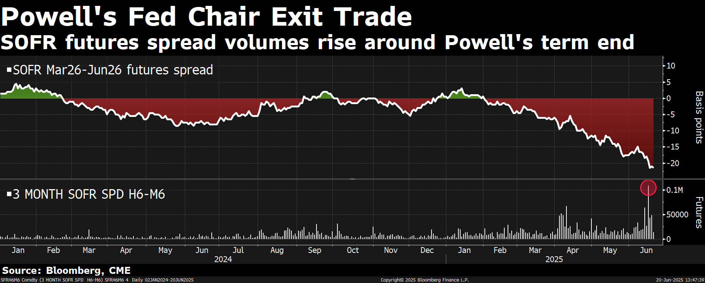

Marekts Price-in 46bps Cuts this Year, Source: Bloomberg

Rates and Credit

As the bread and butter of the market, the rates can be one of the unknown risks in H2. The rise of the rates
across the curve becomes more complex as this is a global phenomenon instead of the sole US issue. The back end
of the JGB, considered by many to be the anchor point of the global duration, has seen major selloff over the past
few years. Gilts and Bunds have the similar pattern.

On the US side, we particularly pay attention to the 2s10s and 2s30s steepening since 2023. The rationale behind
is simple. Starting from 2022 when the inflation reaches 9%yoy in the summer, the market aggressively priced in
the Fed rate cuts. But the unexpected resilience in labor market and sticky inflation forced the short-end to stay
elevated, while the long end priced in a higher for longer regime – stronger long term growth expectation, less
fear of deflation, and a shift away from hard landing landscape.

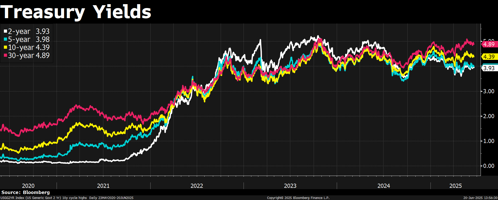

Another major drive is the fiscal concerns. A US deficits grow increasingly persistent – with no clear ceiling on
spending and no credible path to consolidation - investors have begun to demand a higher term premium for
holding long-dated Treasuries. This is especially relevant in the context of rising supply: each new round of
issuance, particularly in the back end, introduces auction volatility and heightens pressure on the curve. This is not
just about near-term headlines, but a broader structural issue. The market appears to be digesting the idea that
debt sustainability itself is becoming a macro risk factor, not merely a theoretical one. The “store-of-value” trade
— visible in the breakout of gold, BTC, and silver — may reflect a slow-moving loss of confidence in fiat credibility
and fiscal discipline.

Concerns around US debt are nothing new — they’ve been circulating since the Volcker era in the 1980s. The
federal budget can be likened to an aging bridge: pressure builds quietly over time, largely unnoticed, until one
day it gives way. By then, it’s too late, and the damage takes decades to repair. While no one can have a crystal
ball, the underlying strain is clearly mounting.

Turning to credit markets, spreads are currently sitting near historical lows — likely reflecting market optimism
around potential Trump-era deregulation. From a valuation standpoint, this doesn’t offer a particularly attractive
entry point.

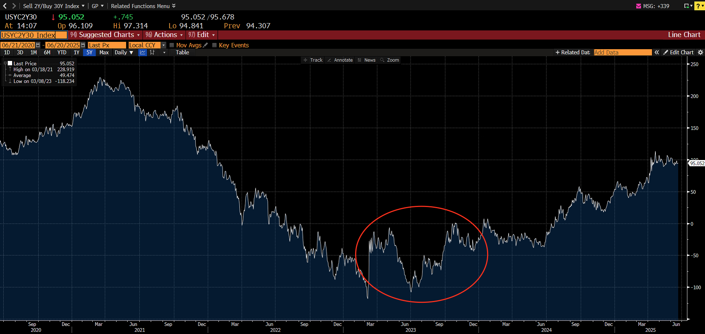

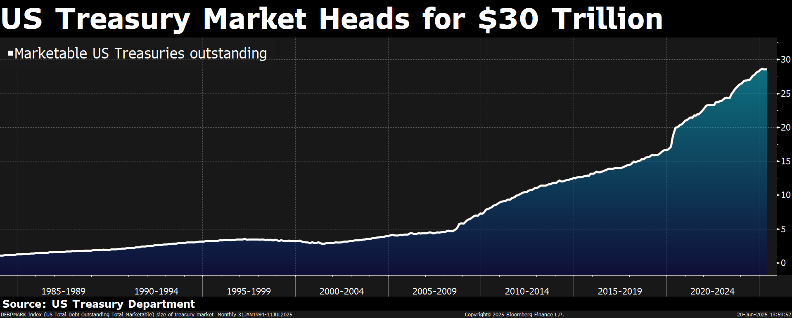

We expect yields to remain elevated in the near term. However, once inflation shows a clear peak and growth
begins to decelerate, the Fed may regain room to cut, setting the stage for a bullish steepening of the curve. When
it comes to the investment, we suggest investors mainly focus on the short duration which continue to offer
compelling cash yields while provide a useful buffer against interest rate volatility

FX

The Dollar has depreciated over 7% this year, falling against nearly all major currencies. This marks a shift in
investor sentiment after years of US asset dominance. While we continue to expect a weaker dollar over the long
term, near-term dynamics have become more two-sided. Some believe the depreciation has gone too far,
particularly given the strength of US equities and corporate earnings. Nonetheless, currency markets are playing a
more central role in shaping relative return expectations, especially as investors reassess global capital flows and
policy paths.

Structurally, we believe the dollar is under pressure from both macro and political forces. A weaker USD could help
the Trump administration achieve several key objectives: narrowing the trade deficit, stimulating nominal GDP
growth, and easing the real burden of debt. At the same time, the US fiscal picture continues to worsen, with large
and persistent Treasury issuance pushing up yields and raising long-term inflation expectations. International
reserve managers — particularly in Asia — are showing less appetite for USD assets, with central banks already
reallocating into gold. If US growth slows and inflation continues to moderate, the Fed may face mounting
pressure to ease, which would add to dollar downside risk.

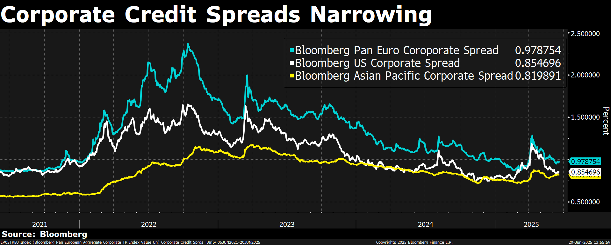

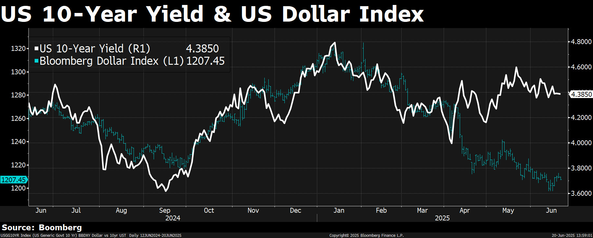

However, we are less convinced that DXY will experience a sharp decline in the second half of the year. Three
factors support this view. First, private sector strength and leadership in AI suggest that US exceptionalism could
reassert itself, supporting capital inflows and the dollar. Second, we remain cautious on the timing and magnitude
of Fed rate cuts. We do think that the rates will remain elevated by the end of 2025, thus carry dynamics would
continue to favor USD over its peers. Third, many EM currencies have already appreciated meaningfully in 2025,
and most DM central banks have already begun — or are in the process of — easing ahead of the Fed. This raises
the risk of FX intervention, particularly in export-driven economies.

Take Japan as an example (we will discuss further in next chapter) — we believe a USDJPY range of 140–150
represents a policy sweet spot for both the BOJ and the Japanese government. It helps sustain domestic stimulus,
keeps exports competitive, and maintains diplomatic alignment with the US on currency management. These
countries’ central banks would definitely take actions to prevent further dollar downside.

Equites

To summarize the YTD performance of the US equities, the Deepseek R1 release challenged the long-held
narrative of US exceptionalism, triggering a wave of skepticism across markets. In February, Microsoft’s decision to
scale back its data center leasing strategy further amplified concerns that AI demand may have been overstated,
especially as this coincided with a sharp decline in the ISM index, raising alarms around cyclical momentum. On
April 2, the market was jolted by the Trump administration’s announcement of a broad-based reciprocal tariff

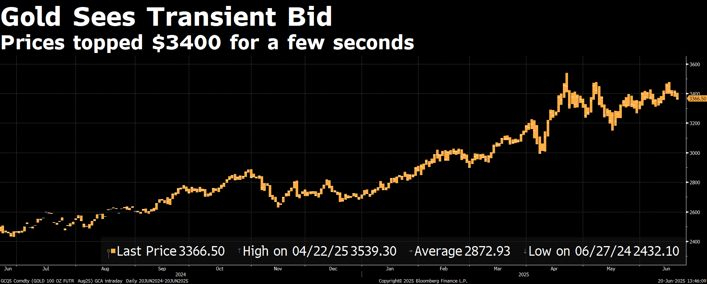

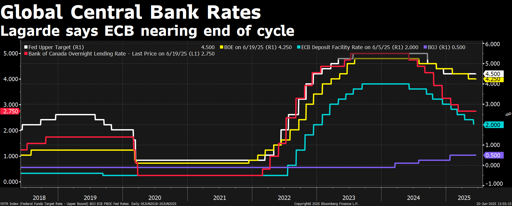

plan, reigniting U.S.–China tensions amid threats of sweeping new tariffs. Ironically, this event marked a short-
term bottom for the equity market. From that point, the administration began reversing course on several
contentious policies and moved toward constructive agreements with key trade partners, including the UK and
China. With recession fears fading and Q2 corporate earnings coming in stronger than expected, sentiment
stabilized. As a result, the S&P 500 has climbed back toward its prior all-time highs, reflecting renewed confidence
in both the soft landing outlook and the resilience of the US business.

SPX Deep V in 2025, Source: Bloomberg

Looking ahead, some risks remain — especially around rate volatility — but with yields having already reached
elevated levels and the recent 10-year auction being well received, further upside in yields may be limited. On the
policy side, uncertainty surrounding Trump 2.0 persists, but his current focus appears to be on pushing the “Big
and Beautiful Bill”. The administration’s implicit strategy of “running it hot” — using deregulation and stimulus to
drive nominal GDP growth — could serve as one of the most powerful tailwinds for US equities in this cycle.

We See a “RUN IT HOT” Scenario in H2, Source: Bloomberg

On the fundamental front, the market continues to discount a future state where AI delivers significant
productivity gains. Over the past few years, a capital-rich, business-friendly environment has laid the strongest
global foundation for AI development in the US. This backdrop remains intact. In the primary market, venture
activity is healthy, with a pipeline of high-quality firms still drawing funding to scale. On the public side, recent
earning calls from Oracle and Broadcom further validate AI’s growing demands, reinforcing investor conviction.

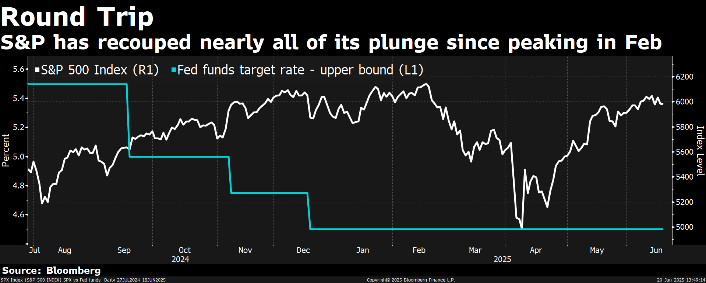

Therefore, even though we remain tactically cautious as the S&P 500 re-approaches its prior highs, there is no
compelling reason to short the market unless SPX decisively breaks below its short-term moving averages. FOMO
(Fear of Missing Out) plays a critical role in bull markets. Institutions are reluctant to reduce exposure too early
and risk underperforming their benchmarks. As long as key moving averages hold, they tend to add to positions
rather than sell, reinforcing the prevailing trend. In this environment, short-term moving averages act not just as
technical signals, but as institutionally defended support zones, creating a self-reinforcing feedback loop. Unless
those thresholds are broken, trend continuation remains the base case — not the exception.

China

In Q2 2025, China’s economy faced mounting headwinds as the tailwinds from Q1’s export rush and stimulus faded,
confirming the cautious stance we took earlier this year. While we highlighted AI breakthroughs like Deepseek and
optimistic Two Sessions signals as potential growth drivers, we stressed the need for economic data to turn
positive—a threshold not fully met. Q1’s robust 5.4% GDP growth, fueled by front-loaded exports and proactive
fiscal measures, gave way to a slowdown in Q2 as the US-China trade war’s impact deepened, despite tariffs
dropping from a peak of 145% to 30% in April. The waning effect of the export surge, coupled with persistent

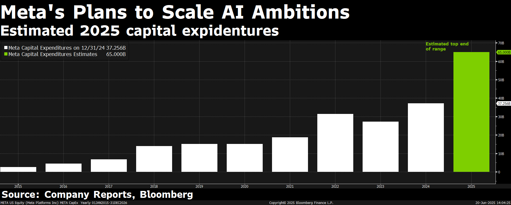

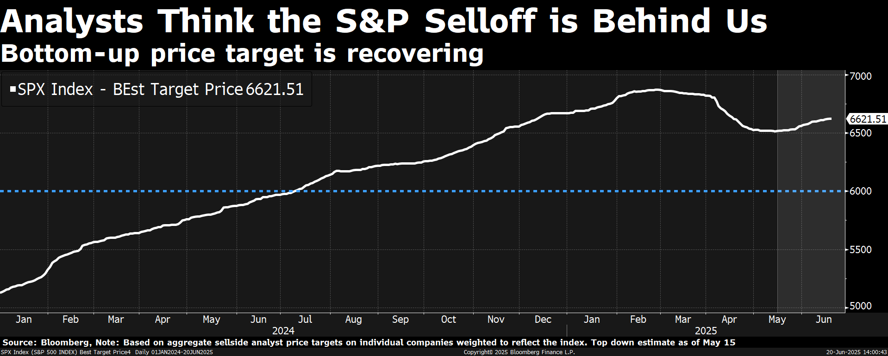

deflation (PPI down 9.1% over 35 months by May), sluggish household consumption, and a faltering property market,
underscored structural vulnerabilities. Though fiscal spending—bolstered by RMB 13.9 trillion in bond financing—
provided a buffer, the timing mismatch between stimulus and trade shocks led to a weaker Q2 performance.

The trade war’s ripple effects were stark. Exports, which drove nearly half of H1’s nominal GDP growth with a $471.9
billion trade surplus (up 40.3% year-on-year), lost momentum as global demand softened and the U.S. prioritized
supply chain reshoring. A 4.6% depreciation in the RMB’s real effective exchange rate by April sustained export
competitiveness, but contracting imports signaled domestic demand fragility. Consumer confidence remained low,
with retail sales lagging manufacturing growth by over 20% since 2020, exacerbating overcapacity and fueling trade
tensions. While AI innovations continued to boost market sentiment, their macroeconomic impact was limited, as
policymakers leaned on supply-side strategies rather than the demand-side reforms we anticipated would follow
Two Sessions cues.

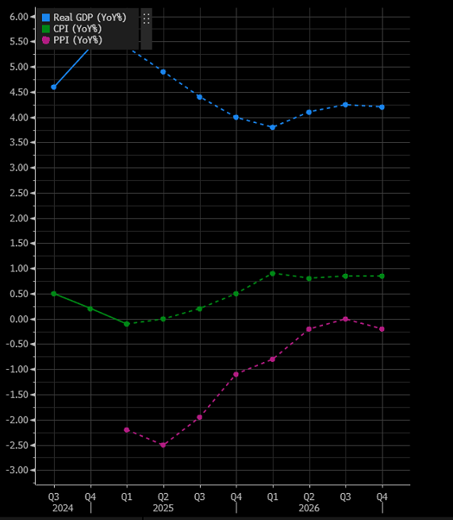

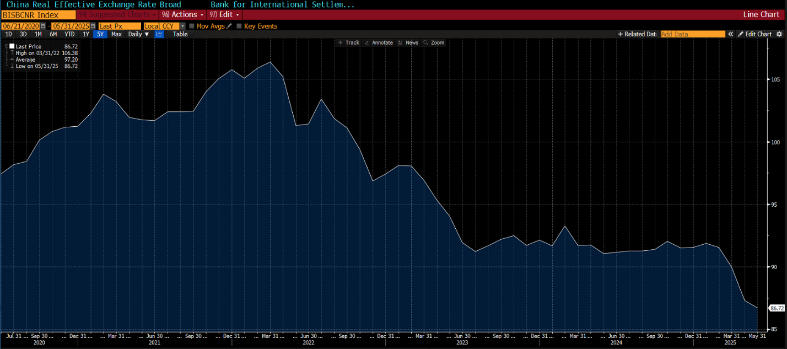

Looking to H2 2025, the outlook hinges on China’s ability to navigate external pressures and address internal
imbalances. The US-China trade dynamic remains volatile, with tariffs at 30% offering relief but no guarantee of
stability. If trade tensions re-escalate, exports—20% of GDP and 30% of 2024 growth—could drag growth below the
5% target, potentially by 2.5% as warned in March. To counter this, policymakers are expected to roll out additional
stimulus, possibly 5 trillion yuan, pushing the fiscal deficit to 16.5%. However, short-term subsidies, like past “trade-
in” programs, risk fleeting gains without sustained demand growth. The output gap, widened by a 35-month PPI
decline, will intensify deflationary pressures unless household consumption, currently 20% below the global average,
is prioritized.

A pivotal shift toward demand-side policies is critical for H2 resilience. Encouragingly, high-level discussions since
late 2024 have signalled intent to curb manufacturing subsidies and boost consumption, though institutional
barriers—such as local government soft budget constraints—slow progress. Strengthened ties with the EU and
ASEAN aim to diversify export markets, but these cannot fully offset U.S. demand losses. The property market’s
renewed downturn and weak fixed-asset investment further cloud the outlook, demanding bolder interventions. If
external pressures from the trade war catalyze a policy rethink, as suggested in March, there’s potential to address
overcapacity and stabilize growth around 4.5%.

In summary, Q2 2025 exposed China’s economic fragility as trade war effects and structural issues outweighed early-
year momentum. While AI-driven sentiment and fiscal firepower provided short-term lift, the lack of robust
demand-side data tempers optimism. For H2, achieving the 5% growth target requires decisive policy shifts to
bolster consumption and resolve overcapacity, amid an uncertain global trade landscape. Without these, China risks
a deeper slowdown, but a strategic pivot could lay the groundwork for sustainable recovery.

香港干诺道中111 号
