# 2026 Global Economic Outlook (I) – US – Alpha Matters More

*Date: 2025-12-22*

2025 年12 月22 日

2026 Global Economic Outlook (I) – US – Alpha Matters More

Review of 2025 - Storms Up Front, Sails at Year-End

2025 will be remembered as a year that tested conviction before rewarding patience. The year opened in disorder
rather than clarity. February’s DeepSeek breakthrough unsettled long-held assumptions around AI leadership and
valuation moats, while April’s “Liberation Day”–style tariff rhetoric delivered another shock to risk sentiment and
revived concerns over policy volatility. In those early months, markets were driven more by headlines than
fundamentals, and confidence in US exceptionalism visibly wavered.

The tone shifted meaningfully from May onward. Constructive agreements between the US, the UK, and China
eased external pressures, restoring risk appetite and catalyzing an “AI Summer” in which technology-linked assets
were aggressively repriced. Crucially, this occurred without policy support: the Fed held rates steady for most of
the year, yet growth proved resilient, inflation remained contained, and the labor market cooled gradually. Jackson
Hole in August marked a turning point in policy communication, and by year-end, three consecutive rate cuts and
renewed liquidity completed a front-loaded drawdown followed by a strong recovery—leaving markets re-
anchored not in euphoria, but in fundamentals.

Global Stock Trend, Source: Bloomberg

Heading into Christmas, the year leaves a clear imprint: 2025 was front-loaded with storms, but it ended with sails
up. That is why we enter 2026 with hope — not naïve optimism, but the tempered confidence that the system
absorbed shocks, repriced risk, and ultimately re-anchored around fundamentals. We would like to take this
chance to wish our readers a peaceful Christmas and a healthy, prosperous New Year. We look forward to
navigating the next chapter together.

Liquidity Improvement – Under-the-Wood Easing

When the market remains anchored on “how many cuts,” we believe the more important regime shift is
happening under the hood. On December 12, the Fed’s implementation arm began Reserve Management
Purchases (RMPs)—monthly purchases of roughly $40bn of Treasury bills aimed at rebuilding and maintaining
reserve buffers and reducing the probability of funding stress. In parallel, a second—and still under-discounted—
leg will arrive next year: the recalibration of the enhanced Supplementary Leverage Ratio (eSLR), effective April 1,
2026, with optional early adoption from January 1. Together, these measures can materially expand large banks’

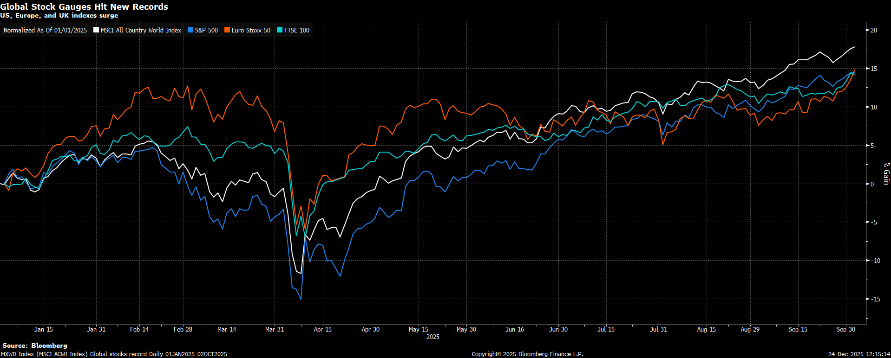

capacity to intermediate Treasuries and repo markets. While many investors treat these as separate “technical”
adjustments, we view them as a single, coherent signal: liquidity conditions are being stabilized ahead of 2026.

A useful way to understand how the Fed controls funding is to think in terms of prices and quantities. The Fed sets
the administered prices of money through its corridor system—IORB (interest on reserve balances) and the ON
RRP facility (the effective floor for money funds and other non-banks). It then manages the quantity of reserves so
that real-world overnight rates (EFFR, SOFR, GC repo) trade where policymakers intend. When reserves are ample,
banks and dealers do not need to bid aggressively for cash, secured funding clears smoothly, and repo volatility
remains subdued. When reserves become scarce or unevenly distributed, funding turns balance-sheet
constrained: cash becomes scarce, repo rates can gap higher, and the system begins to behave nonlinearly. The
Fed does not micromanage daily repo prints; rather, it shapes the operating environment by ensuring the reserve
buffer is sufficient for intermediaries to warehouse collateral and provide funding without stress.

This is why we were watching repo markets well before funding stress became a narrative. Throughout Q3,
funding conditions repeatedly tightened around familiar pressure points—quarter-end, tax dates, and balance-
sheet window dressing. That pattern is precisely what makes policymakers uncomfortable, because it is how
seemingly small plumbing frictions can escalate into systemic risk events. As reserves drift toward a minimum
comfort threshold, repo rates jump, dealer intermediation retrenches, and seasonal pressures can turn
nonlinear—the 2019 playbook. The Fed’s response was telling: balance-sheet runoff effectively ended on
December 1, paired with bill-focused reserve actions, including reinvestment of some MBS proceeds into Treasury
bills, to prevent reserves from sliding further toward that threshold.

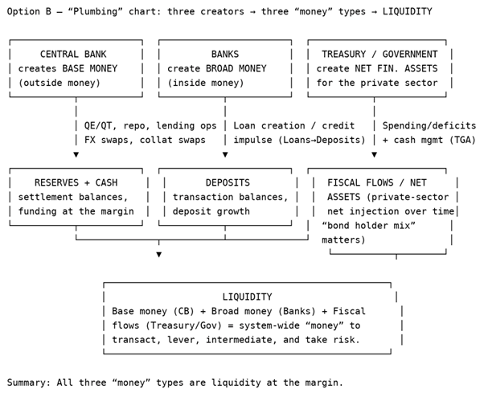

Repo Spiked Back in October, Source: Bloomberg

Looking into 2026, we see liquidity improving through two reinforcing legs—RMP and eSLR—which supports risk
appetite even before debating the precise number of policy cuts.

Leg 1: RMP — reserve “top-up.”
RMP is not QE. QE targets duration by compressing term premia and stimulating demand. RMP is about keeping
the pipes unclogged: purchasing short-dated Treasury bills to add reserves and preserve an ample-reserves
regime. The practical effect is a lower probability of repo and SOFR dislocations caused by settlement cash
shortages, particularly around predictable seasonal swings such as tax dates. The immediate payoff is not faster
growth, but a reduction in left-tail funding risk—the factor that most directly underpins day-to-day market
confidence.

Leg 2: eSLR — expanded private intermediation capacity.
The eSLR represents a binding balance-sheet constraint for large banks. When it binds, banks and dealers are
disincentivized from expanding low-risk but balance-sheet-intensive activities such as Treasury market-making,
repo intermediation, and collateral warehousing. The result is higher repo volatility and more fragile Treasury
absorption. A recalibrated eSLR works in the opposite direction, increasing balance-sheet capacity and improving
the circulation of cash and collateral. Intuitively, RMP adds more cash into the system, while eSLR increases the
size of the pipes through which that cash can flow.

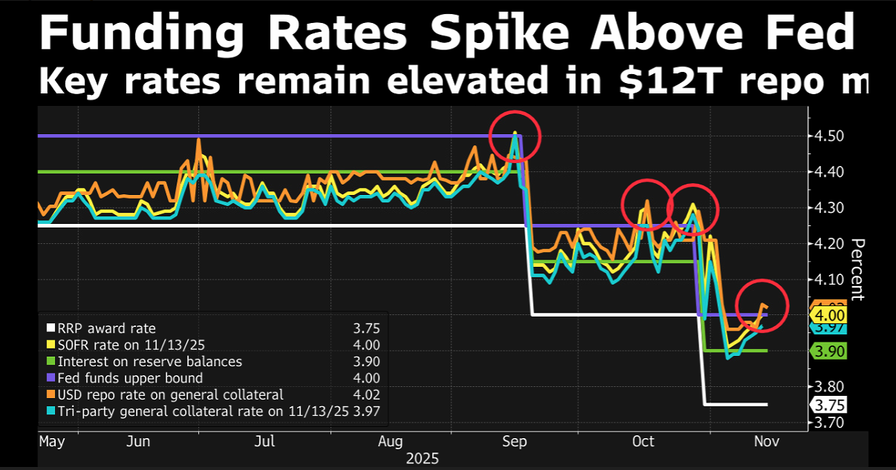

Fed Formally Ended the Balance-Sheet Runoff in December, Source: Bloomberg

Taken together, this framework explains why sentiment can improve meaningfully. When investors fear funding
stress, they de-risk reflexively. When reserve certainty rises via RMP and private-sector balance-sheet capacity
expands via eSLR, the market can carry risk with greater tolerance for shocks and the broader money growth (Such
as M2) can re-accelerate over time. This is not a claim that “everything goes up,” but it does provide a credible
foundation for a more durable risk-on backdrop into 2026—supportive of valuation tolerance and liquidity-
sensitive leadership, particularly financials, small caps, and cyclicals, as the plumbing channel shifts from
headwind to tailwind.

Fed Policy Outlook

Looking back at our Fed call over the past year, the direction was broadly right, but the timing and magnitude
need refinement. We correctly anticipated no rate cuts through the first 9 months, as sticky services inflation and
resilient activity kept the Fed on hold. Where we were early—and ultimately wrong—was in dismissing the
likelihood of cuts late in the year. We underestimated both the speed at which inflation momentum cooled and
the sharper-than-expected turn in labor market dynamics after Jackson Hole, particularly once revisions and
participation effects were accounted for.

What We Were Right and Wrong Back in June/Sep, Source: Poseidon

The macro backdrop has now shifted from overheating to late-cycle deceleration. Growth has lost momentum
since the October–November government shutdown and renewed US–China tensions, with weakness increasingly
visible in hard data and revisions rather than surveys alone. Inflation, in contrast, has behaved far better than
expected. Headline CPI is running near 2.7% YoY, and forward momentum has largely stalled. We see downside

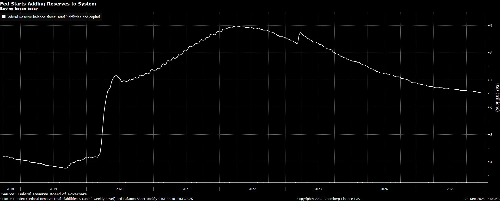

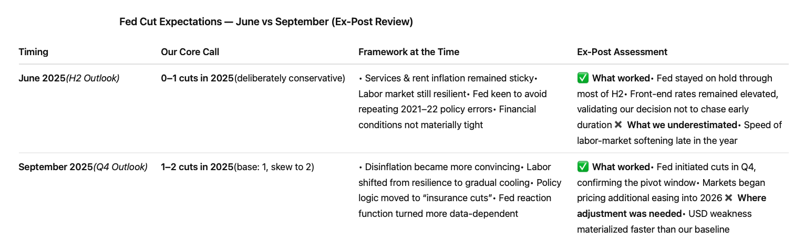

pressure building in coming months as elevated inventories and supply-side adjustments continue to absorb tariff
effects.

US Inflation Has Been Well Contained, Source: Bloomberg

The key reason the Fed has a stronger cutting case than its peers lies in the inventory cycle. Domestic US
inventories of mission-critical goods are unusually high, providing a buffer against price pressures. Copper is a
clear example: inventories have reached levels rarely seen outside crisis periods, largely due to pre-tariff
stockpiling by corporates and high-net-worth investors. With new duties in place, these inventories are effectively
frozen—there is little incentive to move metals back and forth across borders. Copper is not unique; it reflects a
broader trend. Relative to the rest of the world, the US is inventory-heavy, which exports scarcity abroad while
cushioning domestic inflation, aside from the direct tariff impact.

Copper Inventories Exploded in the US, Source: Bloomberg

Labor is where downside risks remain underpriced. Payroll growth has slowed meaningfully, with October
distorted to the downside by shutdown effects and November still weak. More importantly, the unemployment
rate has drifted up to 4.6%, and both three- and six-month averages of job creation point to a clear loss of
momentum. Participation has stabilized, wage growth is cooling, and bargaining power has shifted back toward
employers—a sharp contrast with the 2022–23 environment. Structural forces amplify this dynamic: AI-driven
productivity gains and continued immigration are expanding effective labor supply, suppressing wage pressure
even as headline employment rolls over.

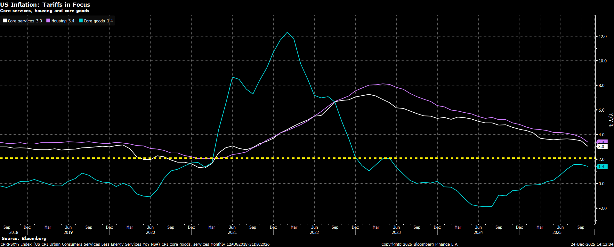

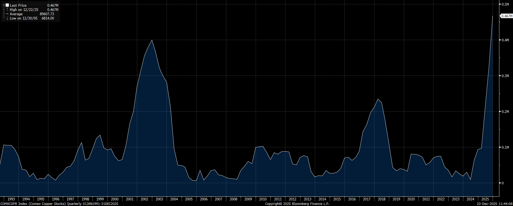

Labor is Where Downside Risks Remain Underpriced , Source: Bloomberg

Household balance sheets are beginning to reflect this strain. New York Fed data show credit card balances at
$1.23 trillion, with a 7.05% transition rate into serious delinquency in Q3, alongside student loan delinquency at
8.13% following the resumption of reporting. These are not crisis levels, but they are inconsistent with a labor
market poised to re-accelerate meaningfully.

Household Debt and Credit Report in Q3 2025, Source: New York Fed

Against this backdrop, our baseline Fed path is straightforward: two cuts in 2026 remain the cleanest call. The
Fed’s December SEP places the median 2026 policy rate at 3.375%, starting from a current target range of 3.50–
3.75%, implying roughly one cut. While dispersion across the dot plot remains wide, the center of gravity has
clearly shifted lower. Our base case is two cuts, likely beginning mid-year, taking the year-end rate to 3.00–3.25%,
with a plausible terminal rate near 3%.

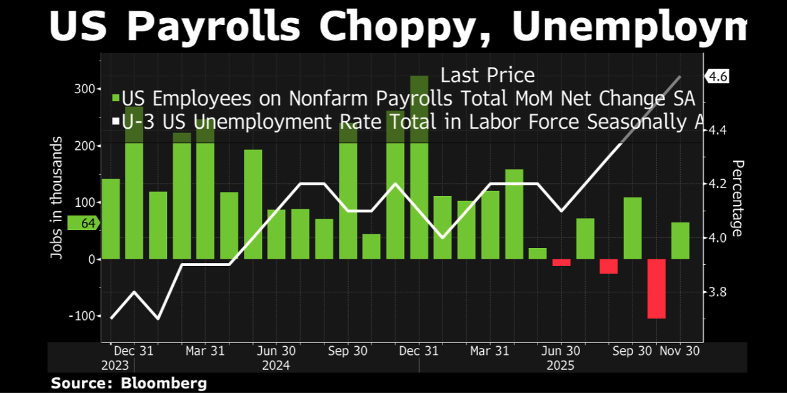

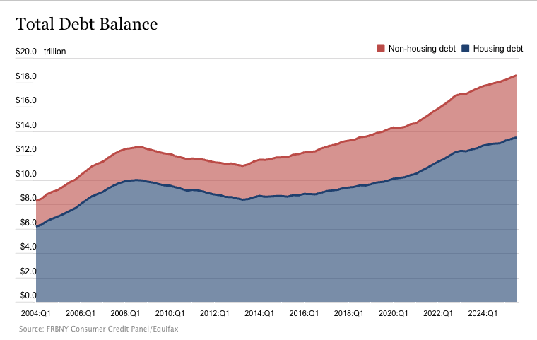

The Most Updated Fed Dot, Source: Bloomberg

The market remains too complacent on labor risk. Inflation containment gives the Fed room to wait, but the
asymmetry is now clear: further employment softening matters more than marginal upside surprises to growth.
Payrolls, participation, and wages are all moving in the same direction. Employers are no longer hoarding labor,
households are increasingly reliant on credit, and delinquency trends point to reduced resilience among lower-
income cohorts. In this setup, the Fed’s reaction function is skewed—additional labor deterioration would likely
trigger easing even if growth remains positive. The Fed is also likely to be among the last major central banks to
pivot back toward tightening once the cycle turns, reinforcing its relative dovishness.

Finally, Fed leadership risk adds volatility rather than altering the median policy path. Powell’s term as Chair ends
on May 15, 2026, while his term as Governor runs through January 31, 2028. Treasury Secretary Scott Bessent has
publicly discussed potential successors, explicitly naming Kevin Warsh and Kevin Hassett, with indications that
President Trump leans toward one of them. As we noted as early as June, this “shadow successor” narrative
matters for markets—but primarily through volatility.

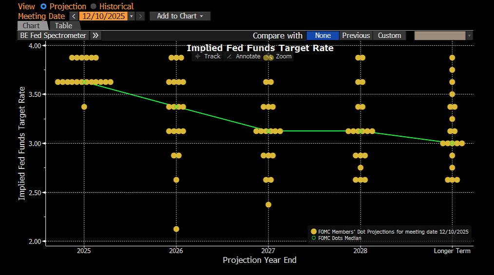

Kevin Hasset Led the Poll of “Who Will be the New Fed Chair”, Source: PolyMarket

Our view remains that the committee matters more than the chair for the baseline policy trajectory. That said, in a
midterm election year, the political incentive is clearly to avoid a hard landing. If labor weakens further, the bias
will tilt dovish regardless of who leads the Fed. Hassett remains our top pick given his proven loyalty to Trump,
while Warsh carries stronger market credibility but potentially greater friction around independence. The key risk
is not runaway inflation, but headline-driven volatility around Fed independence—precisely where term premia
and USD risk premia are likely to reprice episodically.

Rates – Steepener Still Works

Based on the conviction outlined above, we discuss rates and FX together here because they are the most direct,
tradable extensions of the macro framework. As the US–overseas rate differential gradually compresses,
sequencing matters. The US is likely to be among the last major economies to complete a full policy reversal—
from easing back toward tightening. However, the markets rarely wait for macro confirmation. Secondary assets
trade ahead of the cycle, and they do so with a familiar behavioral bias: risk-on regimes stretch winners, risk-off
regimes punish marginal positioning, and narratives overshoot fundamentals in both directions. That reflexivity is
precisely where alpha is created.

We are particularly proud of the work we laid out in both our June H2 outlook and our September Q4 update. In
June, we argued explicitly that the “right” rates trade was not to chase outright duration, but to express the
regime shift through curve structure—favoring 2s10s and 2s30s steepeners. Since then, that framework has been
validated by the data: the US 2s10s curve has steepened by roughly 25bps, reinforcing our view that curve shape,

rather than duration beta, was the higher-signal expression. In September, with the US 10-year trading around 4%,
we did not view outright duration as attractive; since then, yields have drifted higher toward ~4.15%, consistent
with our assessment that structural forces would limit downside in long-end rates. Our caution on credit was
similarly warranted. CDS IG was trading near 47bps in September (now 50bps)—already close to historical tights—
and has since failed to meaningfully cheapen, underscoring that carry has survived, but valuation has not
improved. Where we were less precise was FX timing. While we correctly framed the dollar as structurally
vulnerable as rate differentials compressed, the speed and magnitude of USD weakness in 2025 exceeded our
original assumptions on the timing of Fed cuts—a conviction we adjusted internally in Q4.

Steepener Still Works, Source: Bloomberg

In rates, our highest-conviction expression remains trading the curve steepener rather than betting on outright
duration. Inflation dynamics continue to argue for this approach. US inflation has proven far better behaved than
feared, helped by elevated inventories, supply-chain normalization, and tariff front-loading effects that cap near-
term price pressures. Recent data reinforce that view. As a result, we believe there is further room for the front
end to rally, where the market has not yet fully priced the Fed’s sensitivity to labor-market softening. By contrast,
we do not see a compelling case for a sustained collapse in long-end yields, even if the Fed cuts further. This is not
a cyclical debate—it is a structural one. The rate market is unlikely to return to the 2010s regime. Excessive QE
during the pandemic, persistent fiscal expansion across developed markets, growing concerns around central-bank
independence under new leadership, and a structural shift in UST supply–demand dynamics all point to a higher
terminal rate floor. The fact that German, French, UK, Japanese, and US long-end yields are all sitting near decade
highs underscores that this is a global regime change, not a US-specific aberration.

Within that framework, we continue to view 4% as a fair anchor for the US 10-year, with 4.3% representing an
increasingly attractive entry point given the structural forces likely to persist over the next decade. At the same
time, while our base case remains a soft landing, we cannot dismiss downside risks to employment—particularly
as rapid AI adoption begins to disrupt existing labor-market equilibria. An unemployment rate of 4.6% is not
alarming in absolute terms, but the speed of deterioration from recent lows matters. That asymmetry justifies
holding some duration exposure as insurance, even as we resist framing 2026 as a one-way duration trade.

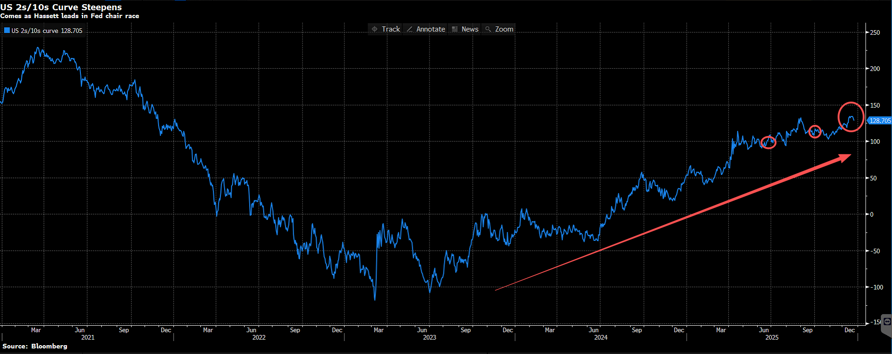

US Treasury Yields by Tenor, Source: Bloomberg

Credit — Carry Is Fine, But You Don’t Get Paid for Optimism

Credit is where discipline matters most. Liquidity stabilization can help carry survive; it does not improve
valuation. Late-cycle temptation is always the same: spreads are tight, defaults are low, and calm is extrapolated
into permanence. When spreads sit near historical tights, investors are not being paid for optimism; they are being
paid to underwrite the absence of volatility. From our perspective, the cleanest way to express this environment is
through CDS indices—earning carry while selling volatility—rather than reaching for incremental spread in cash
bonds.

Earn Carry While Sell Vol, Source: Bloomberg

A telling market pivot emerged in November. Oracle 5-year CDS widened by roughly 39bps as the name became a
convenient hedge for AI-related downside risk. At the same time, CDS IG and iTraxx Main tightened modestly,
outperforming global IG cash indices, which saw spreads widen by more than 3bps amid heavy issuance from
large tech names such as Meta, Google, and Amazon. This divergence is important. Market anxiety around AI
funding and capex has been intense, but in our experience, these concerns rarely translate cleanly into default

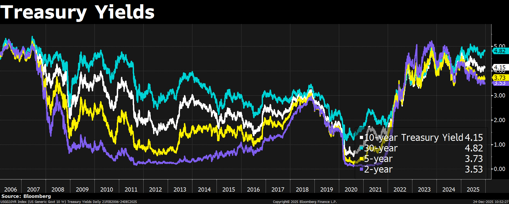

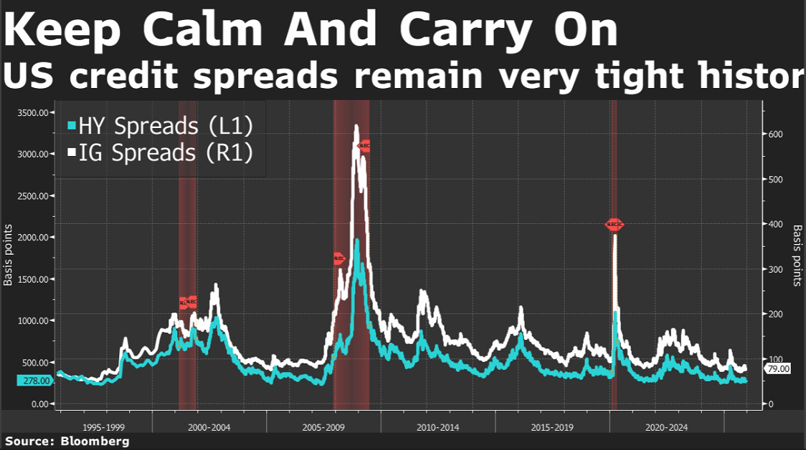

risk. Instead, they tend to create a favorable gamma environment for carry strategies—where volatility spikes are
episodic rather than systemic.

FX – Debasement Trade Continues?

On FX, we openly acknowledge that our June framework underestimated the speed and magnitude of USD
weakness in 2025, largely due to a more conservative assumption around the timing of Fed cuts. We adjusted that
conviction in Q4 internally. Looking ahead, the most material downside risk to the dollar lies in what we would
describe as a “gold crossover”: a sharp compression in US–overseas rate differentials, particularly if central banks
such as the ECB/BOJ/RBA/BoC or others begin normalizing policy while the Fed remains in an easing cycle under
increasingly dovish leadership. Since the Global Financial Crisis, the USD has remained structurally expensive on a
real effective basis, supported by strong productivity, capital inflows, and US innovation leadership. That support
does not vanish overnight—but it does erode gradually as policy asymmetries shift.

Global Policy Crossover, Source: Bloomberg

No crisis is required for this adjustment. A steady grind of rate-differential compression, combined with a market
increasingly willing to pay for diversification outside the US, is sufficient. That said, we believe the upcoming
change in Fed leadership could prove pivotal. If Kevin Hassett ultimately emerges as Chair, markets are likely to
price the embedded dovishness—and Trump’s growth-first bias—rapidly and, in our view, somewhat excessively.
In that scenario, the debasement trade remains our preferred macro expression into the first half of 2026, with
gold and related hedges continuing to play a central role.

Commodities Tend to Act as Primary Beneficiaries in Debasement Trades, Source: Bloomberg

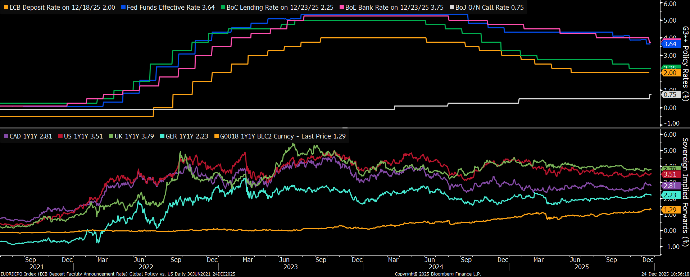

Within FX, alpha still matters. We expect EURUSD to grind higher over time, reflecting relative policy shifts and
diversification flows, while the pace of appreciation in JPY and CNH is likely to be more constrained by domestic
policy considerations. We will explore those dynamics in more detail in next week’s note.

Equities — Constructive, but a Different Market

Our equity stance into 2026 remains constructive, with AI still firmly at the center of the market narrative. What
changes meaningfully versus 2025 is not the direction of travel, but the behavior of the market. If 2025 rewarded
broad AI exposure and narrative participation, 2026 increasingly demands proof—of execution, monetization, and
balance-sheet durability. This is no longer a market where beta alone does the work.

AI momentum is unlikely to fade in early 2026. Demand signals remain intact, hyperscaler investment continues,
and the strategic importance of compute has not diminished. However, the market is clearly transitioning from “AI
optimism” to “AI proof.” Valuation tolerance can persist as long as liquidity remains supportive, but the bar for
sustaining premium multiples is rising. As liquidity gradually shifts from Fed support toward private balance
sheets, markets will increasingly pay for Earnings (E) rather than multiples (P).

Estimates of Annual US Corporate Revenue Growth Through 2030, Source: BlackRock 2026 Outlook

This transition has direct implications for volatility. We expect wider equity swings in 2026, particularly around
earnings. Small misses in guidance, capex pacing, or margins are increasingly likely to trigger outsized re-pricing,
even when long-term fundamentals remain intact. Leadership should persist, but dispersion—both across sectors
and within the AI ecosystem—will widen materially.

This dynamic is most visible among hyperscalers and AI infrastructure leaders. The key question for 2026 is no
longer whether AI spending continues, but who can fund it sustainably. Aggregate hyperscaler capex for 2026 is
often discussed in the $400–600bn range, but capital intensity alone is no longer sufficient to justify valuation.
Funding quality, free-cash-flow trajectories, balance-sheet flexibility, and ROI visibility are becoming the primary
gating factors for multiple support—especially in a world where long-end yields remain structurally elevated.

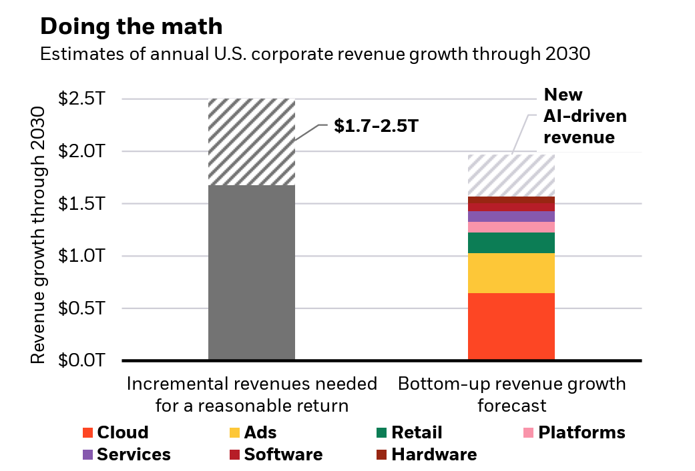

Hyperscalers Are Buring Free Cash Flow, Source: Bloomberg

As AI scales, the opportunity set broadens beyond chips and software. Compute increasingly becomes a power
and infrastructure story. Data-center-driven electricity demand is reshaping investment priorities across
generation, grid, and storage. Power availability and grid-connection timelines are emerging as binding
constraints, influencing both where AI capacity is built and how quickly it can be monetized. This creates
opportunities in second-derivative beneficiaries—energy supply, grid upgrades, transmission, and storage—where
demand visibility is improving and crowding is often lower.

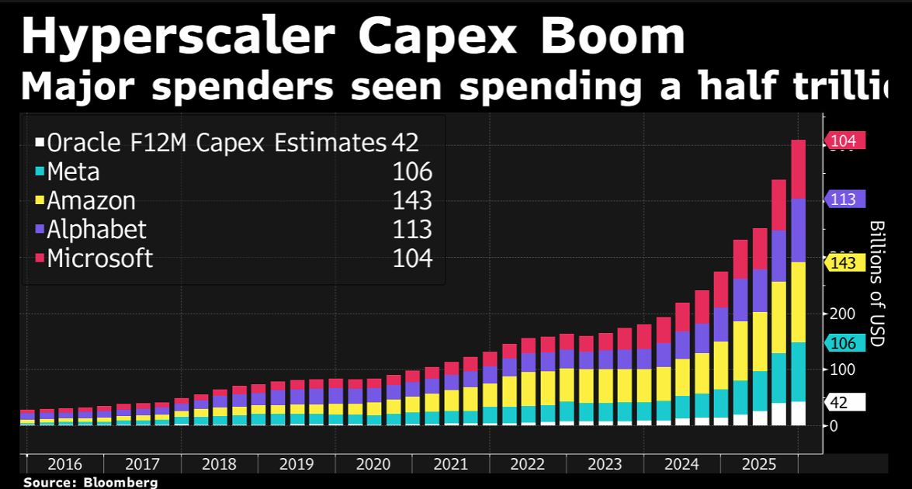

US Genesis Mission List, Source: Poseidon

From a portfolio-construction perspective, this is an environment that rewards selectivity, not retreat. High
valuations can persist when liquidity is ample, but liquidity is not evenly distributed. We expect a winners-take-
most dynamic within AI and its enablers, placing a premium on quality bias, sizing discipline, and balance-sheet
strength. Maintaining dry powder is essential, as sentiment-driven dislocations are likely to create opportunities
rather than signal regime breaks.

In short, 2026 is shaping up to be a stock-picker’s year. We remain pro-equity and pro-AI, but less tolerant of
narrative fragility. The objective is not to avoid volatility, but to survive it—and deploy capital when the market
temporarily misprices fundamentals.

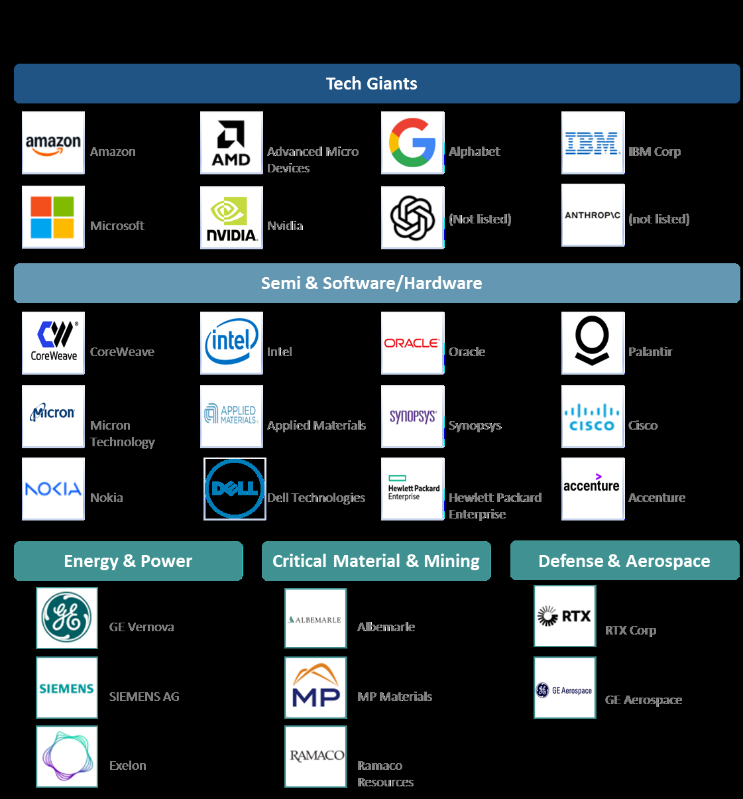

香港干诺道中111 号
