# 2026 Global Economic Outlook (II) – China & Japan – The Quiet End of Old Models

*Date: 2026-01-02*

2026 年1 月2 日

2026 Global Economic Outlook (II) – China & Japan – The Quiet End of
Old Models

Review of China 2025 – Holding Up Externally, Constrained at Home

China’s economic narrative in 2025 has been one of resilience without momentum. On the surface, growth has held
up better than many feared, supported by front-loaded exports and an aggressive fiscal response in the beginning
of the year. Beneath that stability, however, the economy remains constrained by a familiar set of structural frictions:
weak household demand, a still-fragile property sector, and a prolonged deflationary impulse that reflects not
excess supply, but insufficient confidence. The apparent strength of early-year data masks a deeper imbalance —
growth has been achieved, but not internalized by incomes or expectations.

Exports and fiscal spending have acted as temporary shock absorbers rather than durable engines. Trade
outperformance earlier in the year benefited from currency competitiveness and timing effects, while government
borrowing accelerated to offset external pressure. Yet both channels face diminishing returns. Export momentum
is increasingly vulnerable to global demand and trade frictions, while fiscal impulse remains skewed toward the
supply side, limiting its ability to revive consumption. Meanwhile, deflation has persisted, underscoring the
absence of a self-sustaining demand cycle and reinforcing a low-nominal-growth equilibrium.

China Trade Surplus Remains Elevated Despite Domestic Weakness, Source: Bloomberg

Policy space still exists, but policy effectiveness is constrained. Monetary easing can cushion downside risks, yet
cannot, on its own, repair household balance sheets or restore animal spirits. As 2026 approaches, China’s outlook
hinges less on incremental stimulus and more on whether a genuine demand-side rebalancing can take shape.
Until then, the economy is likely to remain stable, but subdued — supported by policy, yet searching for a new
internal driver of growth.

Macro Overlook – Growth Achieved, Momentum Contained

Growth in 2025 has come in better than we initially expected and, crucially, appears sufficient to meet the central
government’s core objective. While full-year GDP has yet to be finalized, real growth averaged around 5.2% YoY

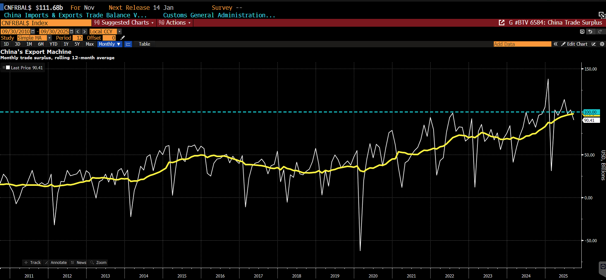

over the first nine months. With momentum softening into Q4, full-year growth is likely to settle in the 4.8–5.0%
range, broadly in line with the official target. From a policy standpoint, headline growth delivery remains
paramount — and on that metric, policymakers can credibly claim success.

Signals from the Central Economic Work Conference reinforce this assessment. Compared with 2024, the policy
tone has softened noticeably, reflecting a degree of satisfaction with this year’s outcome. Official messaging
continues to stress the need to support domestic demand while keeping investment stable, rather than launching
an aggressive recovery push. In short, as long as growth remains intact, there appears to be limited urgency to
materially escalate stimulus.

Central Economic Work Conference Tone Shift, Source: Poseidon

Growth Composition – Exports Carrying

The composition of growth confirms our October assessment: the macro backdrop remains disinflationary and
property-constrained. China’s relatively strong headline GDP outcome in 2025 was driven primarily by exports
rather than domestic reflation. Early in the year, renewed tariff risks prompted Chinese exporters and US
importers to front-load shipments, materially boosting Q1 growth. Although export momentum moderated later,
trade tensions were de-escalated relatively quickly through mid-year and autumn negotiations, allowing exports
to continue contributing meaningfully despite fading tailwinds.

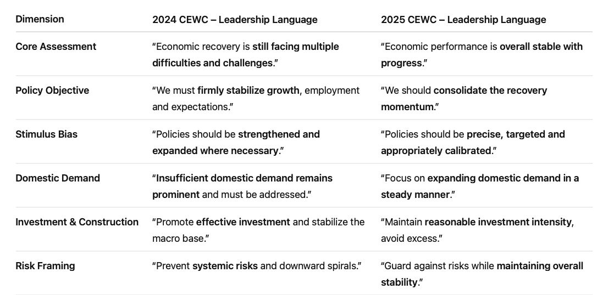

China Contribution Share to the Growth of GDP, Source: Bloomberg

By contrast, consumption contributed to headline growth largely as a stabilizer rather than a true engine.
Persistent weakness in CPI and PPI highlights the lack of pricing power and confirms that disinflationary pressures
remain entrenched. As a result, nominal GDP growth likely undershot real GDP, settling closer to 4.3–4.5%. Fixed-
asset and government investment — historically the backbone of China’s growth model — remained subdued,
with no convincing signs of cyclical recovery.

The property sector continues to act as the binding constraint. While tier-one cities have shown pockets of
resilience, broad-based weakness in prices and transaction volumes persists. Consumption and property dynamics
are tightly linked: housing represents a substantial share of household leverage and perceived wealth. Without a
sustained recovery in property prices, household confidence remains fragile, limiting the willingness to increase
discretionary spending. Weak consumption, therefore, is not an isolated issue but a downstream consequence of
the ongoing property adjustment.

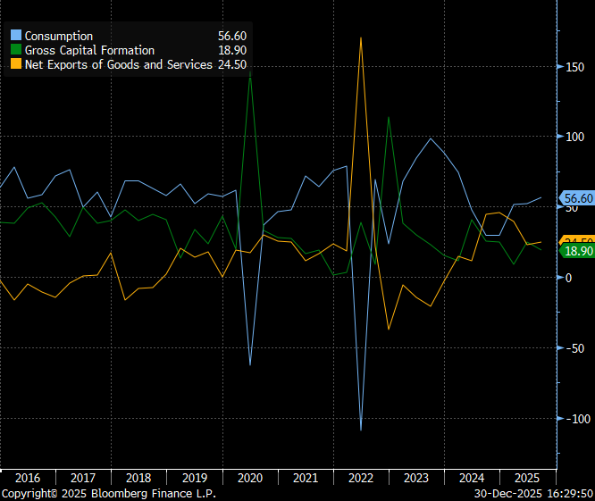

Broad-Based Property Weakness Due To Lack of Confidence, Source: Bloomberg

Policy Transmission – Fiscal Substitution, Monetary Constraints

From a leverage perspective, the limits of fiscal substitution are increasingly evident. Since the property downturn
began in 2022, government financing has increased by an average of roughly RMB 4.7 trillion per year between
2023 and 2025, compared with an annual decline of about RMB 3.6 trillion in property sales. Yet this expansion
has failed to close the output gap or reverse deflation, underscoring the significantly lower efficiency of fiscal
spending relative to property-led demand. In practice, much of the injected liquidity has remained within the
banking system rather than flowing through to households.

This reflects both balance-sheet caution and incentive constraints within the banking sector. With net interest
margins compressed (around 1.42%) and asset-quality risks still elevated (nonperforming loan ratio around
1.52%), banks have little appetite to expand lending aggressively. In this environment, preserving balance-sheet
integrity takes precedence over credit growth. As a result, recent stimulus efforts have had limited traction in
reviving private demand.

China Banks NIM (White) vs China Banks Nonperforming Loan Ratio (Orange), Source: Bloomberg

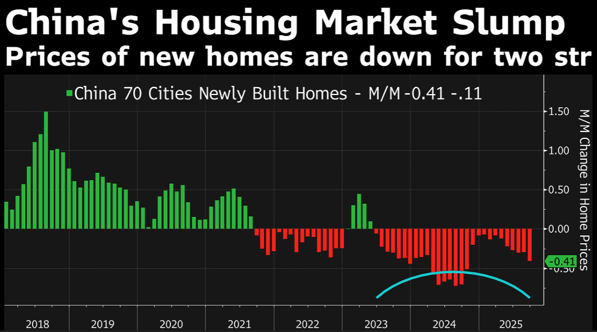

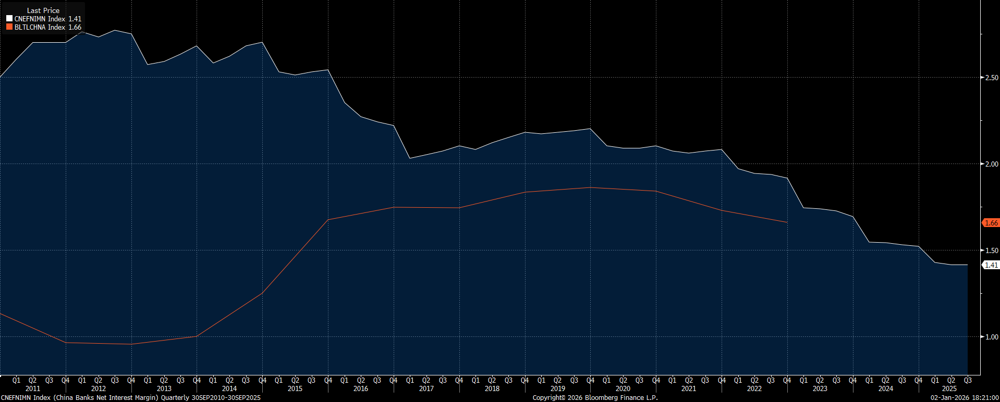

Monetary policy constraints further reinforce this dynamic. In 2025, the 1-year LPR was cut only once — by 10bps
in May, far less than the roughly 40bps of easing priced in at the start of the year. While headline rates remain low,
the room for aggressive cuts is constrained by banking-sector profitability and financial-stability considerations.
We therefore expect the PBOC to continue favoring RRR cuts, targeted liquidity tools, and window guidance over
broad-based rate cuts unless growth deteriorates meaningfully.

Looking ahead, we expect China’s real GDP growth to moderate toward ~4.5% in 2026, with disinflationary
pressures persisting and nominal GDP growth closer to ~4%. A stimulus package on the scale of Q4-2024 appears
unlikely. Policy support will remain measured, targeted, and defensive — focused on preserving stability rather
than engineering a decisive reflation.

FX – Managed CNY/CNH Appreciation

FX was one of the clearest consensus mispricings of 2025. At the start of the year, the market overwhelmingly
expected a sharp RMB depreciation, with forecasts clustered around 7.6–7.8. Our own view was more
conservative — centered on a 7.20–7.30 range — yet even that proved too bearish. The RMB not only resisted
depreciation, it staged a steady and, in Q4, accelerating appreciation. That outcome forces a reassessment of
several assumptions that were widely held—but ultimately flawed.

Market Consensus on USDCNH Back in March 2025, Source: Bloomberg

The first miss was the dollar. As we discussed in our previous note, the magnitude of USD weakness was
underestimated across the board. Few anticipated a year-end sequence of three Fed cuts, nor the speed at which
rate differentials would compress. At the same time, the PBoC maintained a distinctly hawkish bias—not in the
sense of tightening, but in preserving financial stability and protecting the banking system. China did not follow
the global easing impulse mechanically, and that policy divergence mattered more for FX than growth pessimism
did.

Second, China’s export performance in Q1 surprised meaningfully to the upside. Front-loaded shipments, partly
driven by tariff anticipation, delivered stronger-than-expected external momentum. In that context, the PBoC had
both the room and the incentive to tolerate a gradually stronger RMB—at least through December. The logic is
straightforward: when exports are performing well, allowing a controlled appreciation helps relieve external
pressure, moderates imported inflation, and signals restraint to trading partners, particularly the US. It is
politically and economically easier to manage FX strength when exporters are still making money.

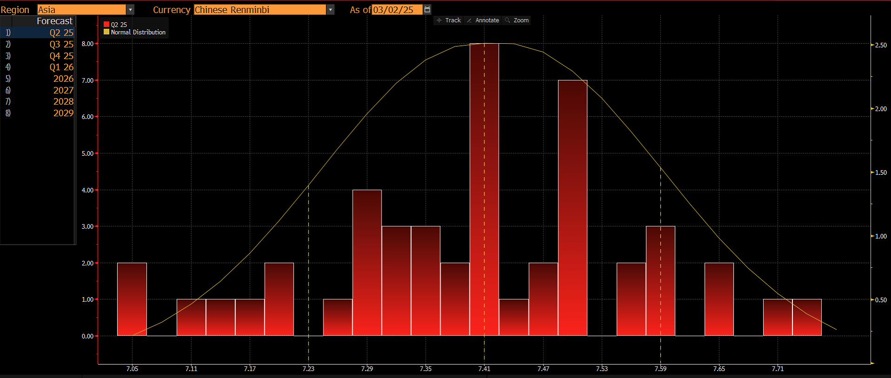

PBoC Is Tolerating a Stronger RMB Especially in December, Source: Bloomberg

Third—and still underappreciated—capital flows mattered more than trade flows. Over the past several years of
Fed tightening, China faced persistent and sizable capital outflows. From a policy-ranking perspective, stabilizing
capital flows arguably matters more than maximizing exports. Once US rate pressure eased and global financial
conditions loosened, the marginal capital outflow constraint relaxed. That alone removed a key structural
headwind for the RMB, regardless of China’s cyclical growth concerns.

Finally, exporter FX settlement became a powerful accelerator late in the year. As Fed cuts approached, Chinese
exporters increasingly chose to convert USD proceeds into RMB earlier rather than later, effectively front-running
lower carry. This created a degree of crowding in Q4. Exporter settlement flows are inherently seasonal—tending
to pick up toward year-end and ahead of the Lunar New Year as firms meet payroll, tax, and balance-sheet needs.
State-owned banks absorbed much of this flow, but the net effect was a visible pickup in RMB appreciation
momentum into December and January.

Looking ahead, we see scope for further RMB strength in early 2026, particularly into the Lunar New Year period,
with levels near 6.8 achievable. China’s room for additional rate cuts remains limited, while the US faces downside
labor-market risks and potential policy shifts under a new Fed leadership, pointing to further narrowing in yield
differentials and potential capital reflows into RMB assets.

USDCNH Trend in the Past 15 Years, Source: Bloomberg

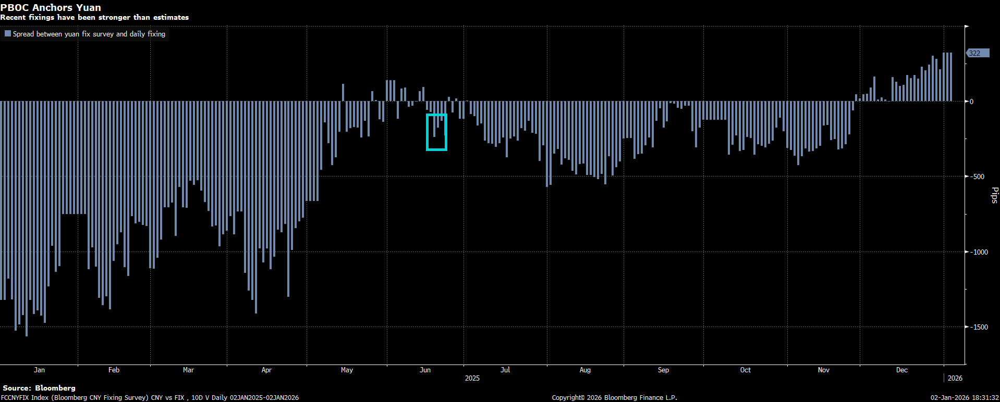

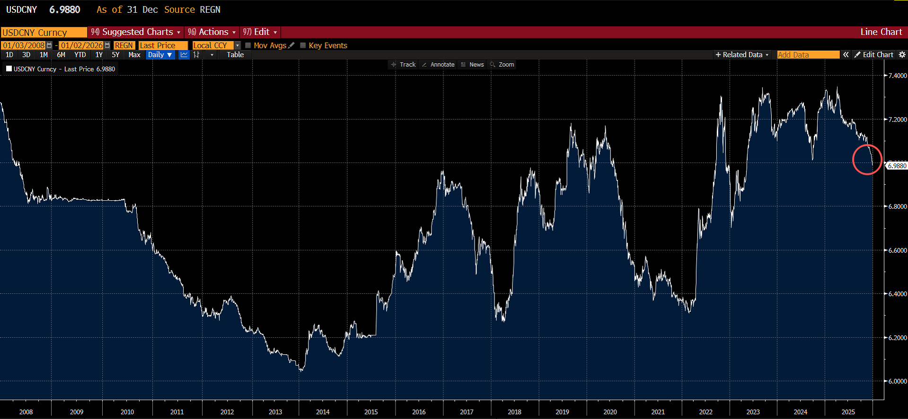

That said, FX policy will remain conditional. The PBOC is likely to adjust the fixing dynamically in response to
export data, ensuring that currency strength does not undermine growth objectives. China’s rising export
competitiveness has already intensified trade frictions beyond the US — with anti-dumping and countervailing
measures emerging across the EU, Turkey, Brazil, Mexico, and parts of Asia. Since 2024, several regional
economies, including Vietnam, South Korea, and India, have implemented new trade barriers targeting Chinese
goods. These developments underpin our expectation that export growth will slow into 2026, constraining
tolerance for sustained RMB appreciation.

Overall, we expect USD/CNH to trade within a managed range of 6.7–7.0 next year — reflecting structural
appreciation forces tempered by policy calibration rather than a one-way directional trend.

China – Equities: Strong Performance, Fragile Conviction

Chinese equities delivered a strong performance in 2025, though gains were highly concentrated. Leadership
came primarily from technology, select areas of new consumption, and financials—particularly banks and
insurers—rather than a broad-based reflation. Importantly, the dominant marginal buyer in H-Share was
southbound capital from the mainland, not foreign inflows. Domestic liquidity and policy-driven positioning,
rather than renewed global confidence, defined the equity tape.

HSI Led Global Equity Indices, Source: Bloomberg

Despite the headline strength, the market remained largely sentiment-led. Fundamentals improved at the margin,
but rarely to a degree sufficient to justify sustained re-rating. Valuations across many segments remain optically
cheap relative to history and global peers, yet low valuation alone has proven insufficient as a catalyst. Without a
decisive demand-side recovery or earnings inflection, rallies have tended to be sharp but short-lived—tradable,
but not self-sustaining.

Looking ahead, we continue to favor positioning aligned with the government’s strategic priorities. In China,
returns are often generated upstream—early in the policy cycle—where state-led investment, industrial
upgrading, and capital allocation are most concentrated. Sectors tied to domestic substitution, strategic
manufacturing, and government-backed pre-investment projects have historically offered asymmetric upside, as
early participants benefit from policy visibility and funding support before capital is crowded in later rounds.

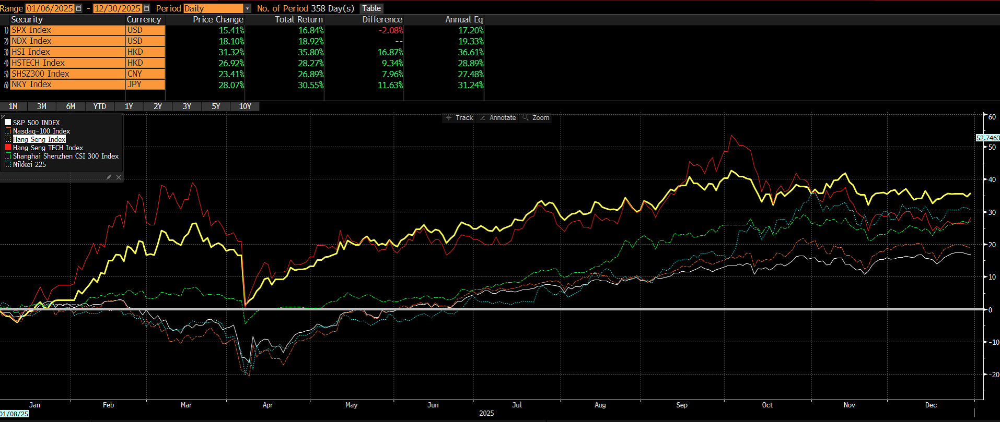

Chinese AI Infrastructure and Domestic Substitution Leaders, Source: Bloomberg

Conversely, we remain cautious on downstream sectors where competition is intense and margins are structurally
compressed. China’s internal “involution” remains a powerful force, particularly in consumer-facing and end-
product industries. Electric vehicles are a case in point: while long-term penetration remains attractive, the
segment has become increasingly difficult to trade due to price wars, overcapacity, and rapid model cycles.

Instead, we prefer to look higher up the value chain. If EV adoption continues, demand does not stop at the final
product—it flows upstream into capital goods and critical inputs. Machine tools, advanced manufacturing
equipment, and components such as magnets and precision materials stand to benefit from both electrification
and broader industrial upgrading. These upstream segments typically face less pricing pressure, enjoy higher
barriers to entry, and align more closely with policy objectives, making them better candidates for structural
exposure rather than purely tactical trades.

Chinese EVs Struggled Among Competition, Source: Bloomberg

In short, We do not expect broad-based re-rating in Chinese equities. Our preference is to be long upstream,
policy-prioritized industries — such as industrial equipment, high-end manufacturing, and key inputs — where

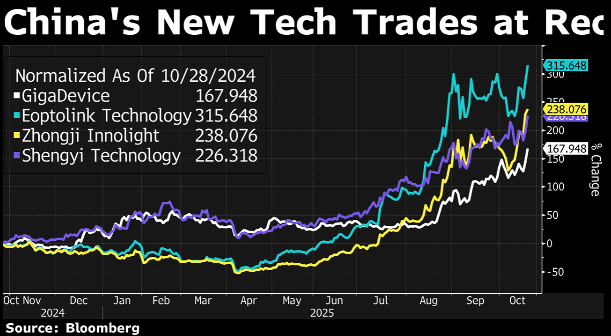

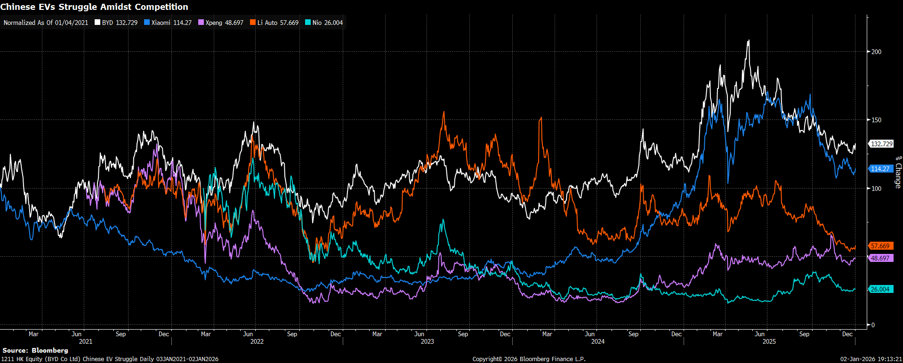

demand is funded and competition is manageable. We are structurally underweight downstream consumption,
autos, and highly competitive end-product sectors, where deflationary pressure and price wars continue to erode
returns despite low headline valuations - much of “cheap China” remains cheap for structural reasons.

Repricing A New Japan Under Abe 2.0

In our Q4 outlook, we shared a photo taken during a trip to Okinawa, capturing LDP campaign posters ahead of
the leadership race. What we failed to disclose at the time was that, earlier that same afternoon, we had managed
to flip a jet ski into the sea. Over the past few years, whenever it comes to Japan — and particularly JPY — we
have shown a consistent talent for falling off the vehicle while confidently explaining where it is headed.

October delivered another such moment. We leaned toward Shinjiro Koizumi as the next prime minister — a call
that felt clean, logical, and entirely consistent with a familiar narrative. Instead, Sanae Takaichi emerged on top. In
hindsight, the miss was not about misreading a candidate, but about clinging to an outdated framework. We
approached Japan through an “old Japan” lens: conservative party norms, rigid political hierarchies, and an
implicit assumption that visible change — including a female prime minister — would face structural resistance
within the LDP. It was a comfortable assumption. It was also wrong.

Takaichi’s rise was neither an anomaly nor a market shock. Many had flagged her viability all along. The real
surprise was ours — we were analyzing a changing Japan with a model built for the past. That realization is
precisely why we frame this section as New Japan.

The key change is not ideological surprise, but policy intent. Takaichi represents a departure from technocratic
incrementalism toward a framework that elevates fiscal policy, national security, and strategic autonomy to first-
order macro variables. As a result, Japan’s macro narrative is shifting away from a single-axis BOJ story toward a
more complex mix of fiscal expansion, geopolitical posture, and policy credibility. This marks a regime change for
investors: Japanese assets can no longer be priced solely through the lens of global liquidity and yield differentials.

Japan’s Yield Curve Reprices Amid Fiscal Expansion and Policy Regime Shift, Source: Bloomberg

In this sense, “New Japan” is not about volatility for its own sake, but about re-pricing relevance. Japan is moving
from a funding source and beta expression to a country with its own macro identity — one that increasingly
generates, rather than suppresses, risk. How this translates into rates, FX, and equities will differ by asset class,
but the overarching implication is clear: Japan now demands a more deliberate, top-down framework. The old

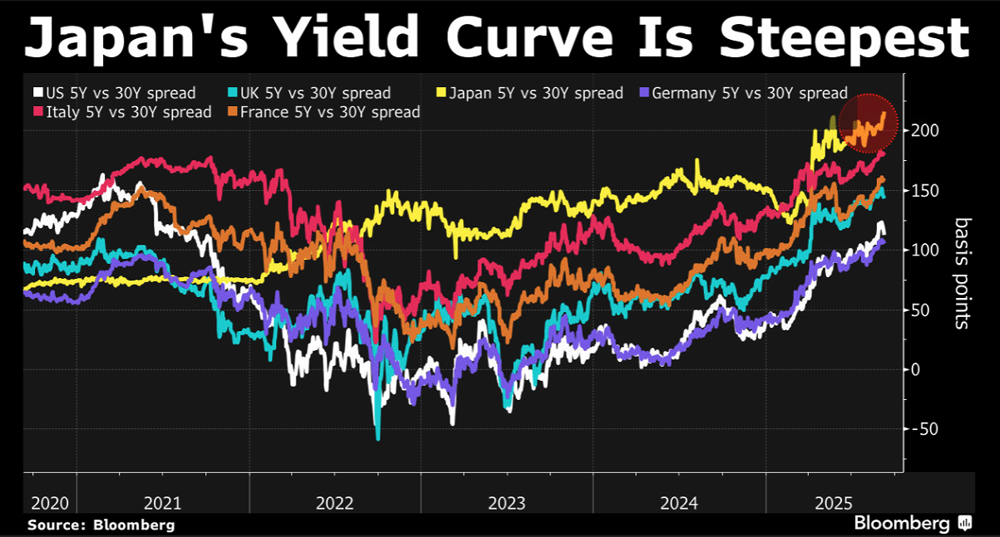

playbook still matters — but it is no longer sufficient.

Inflation, Real Wages, and the BOJ–Fiscal Division of Labor

Japan’s inflation story remains incomplete — and that incompleteness is precisely what drives both policy caution
and fiscal activism. While headline CPI has stayed above 2%, the composition and persistence of inflation remain
uneven. Cost-driven components, particularly energy and food, have led the cycle, while wage pass-through has
lagged. As a result, real wages have continued to face erosion, even as nominal wage negotiations have improved.

Japanese Wages Were Eroded by High Inflation, Source: Bloomberg

This gap matters politically and economically. Japan has finally exited deflation, but households have not yet
internalized inflation as a stable, income-supported regime. Real purchasing power remains fragile, especially
among fixed-income and aging demographics. In this context, inflation is not a policy success to be celebrated, but
a political risk to be managed.

This is where Takaichi’s fiscal strategy fits in — not as stimulus, but as stabilization. Her policy focus is not broad-
based demand expansion, but targeted income support designed to absorb inflationary pressure at the household
level. Energy subsidies, cost-of-living relief, and selective transfers are intended to prevent inflation from
translating into a sustained decline in real incomes. The objective is straightforward: compress the gap between
prices and wages, stabilize public sentiment, and secure political durability in an environment where inflation is
present but not yet trusted.

Crucially, this fiscal approach does not seek to replace monetary policy. It complements it.

On the monetary side, the BOJ remains committed to normalization — but not acceleration. Inflation is still
expected to persist over the coming years, particularly in services, and policy rates cannot remain permanently
anchored near zero. However, the path forward is deliberately cautious. Each BOJ MPMs in 2025 were followed by
yen weakness, reinforcing the market’s perception that Governor Ueda is prioritizing stability and optionality over
hawkish signaling. Communication has consistently emphasized gradualism, data-dependence, and sequencing.

Our base case remains continued but gradual normalization. From the current 0.75% policy rate, we expect one
additional 25bp hike in 2026, contingent on Shunto wage outcomes and the persistence of core inflation. The
purpose of this hike is not to restrain growth aggressively, but to ensure inflation becomes fully embedded — and
to prevent the yen from becoming excessively weak. The emphasis is on “excessively”: policymakers are clearly
tolerant of a weak currency, but not of disorderly depreciation that risks imported inflation or political backlash.

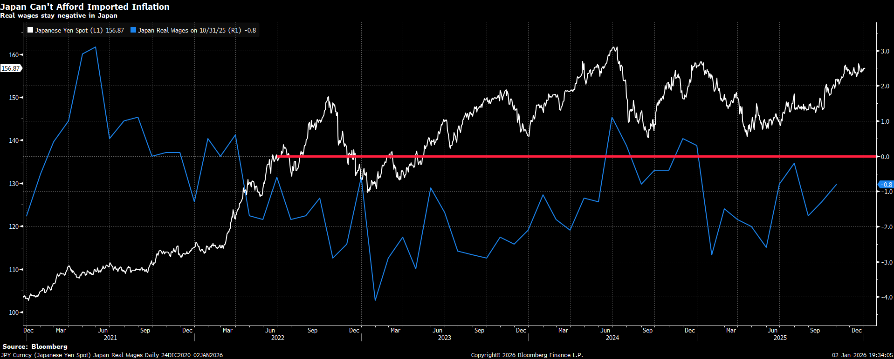

Global Rate Crossover, Source: Bloomberg

Importantly, Takaichi has strong incentives to maintain close coordination with the BOJ. While she has little
appetite for aggressive tightening, she equally cannot afford a scenario in which inflation erodes real incomes
faster than fiscal tools can offset. In this sense, fiscal subsidies buy time, while gradual rate hikes preserve
credibility. One absorbs social pressure; the other anchors expectations.

The result is a policy division of labor rather than a conflict. Fiscal policy leans against inflation’s political cost.
Monetary policy leans against inflation’s macro persistence. Neither side is in a hurry, but both are aware that
credibility — economic and political — depends on keeping inflation controlled, incomes supported, and the yen
weak, but under control.

Rates – JGB as a Fiscal Asset

For most of the past decade, the JGB market was effectively priced as a central-bank instrument: a low-volatility,
policy-administered curve where the BOJ’s purchase function mattered more than fundamentals. In that regime,
long-end duration often felt like “free carry” — volatility was suppressed, auction risk was absorbed, and the
marginal buyer was, in practice, price-insensitive.

Under a Takaichi-style policy mix, that framing becomes harder to defend. The long end increasingly trades like a
fiscal asset rather than a pure BOJ liability. The market starts to care about the supply function — not just the
amount of issuance, but the credibility of the medium-term fiscal path and the political tolerance for persistent
deficits. Defense spending, social security commitments, and strategic capex programs are not cyclical one-offs;
they are structurally sticky. The implication is straightforward: beyond 10y, the curve begins to embed a higher
term premium that is less compressible by communication alone.

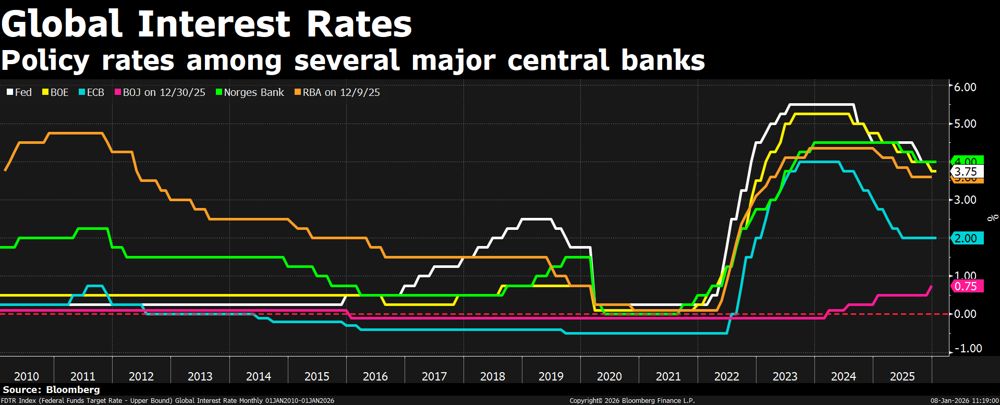

Long-End JGB Suffered a Lot Since Covid, Source: Bloomberg

Practically, this regime is more prone to bear steepening episodes and auction-driven volatility. Even if the BOJ
continues gradual normalization and remains a stabilizing force, investors should be cautious about treating long-
end JGBs as a “no-risk anchor.” The relevant watchpoints shift from meeting-by-meeting policy rates to MoF
issuance composition, BOJ purchase/reduction cadence, and foreign participation at auctions. In short: if you still
approach the back end as BOJ-administered duration, you are trading yesterday’s Japan.

FX – JPY as a Hybrid Risk Currency

The old yen playbook was clean: Japan ran ultra-loose policy, the yen funded global carry, and in risk-off events it
reverted to a reliable haven. The entire structure implicitly assumed Japan was a passive macro participant — a
stable, predictable backdrop whose main export to the world was cheap funding and low volatility.

“New Japan” complicates that simplicity. Under a Takaichi-era repricing, JPY becomes a hybrid risk currency — still
sensitive to rate differentials, but increasingly shaped by a second and third layer: fiscal premium and geopolitics
premium. Fiscal expansion and security-first posture do not automatically imply a weaker yen in the textbook
sense, but they do change what the currency represents. In Asia-tail scenarios, the yen’s haven function is no
longer “pure,” because Japan itself is more directly implicated in the region’s security distribution. Meanwhile, if
fiscal flexibility and supply risk lift domestic term premium, the yen can simultaneously experience periods of
strength (via narrowing differentials) and periods of weakness (via risk premium and policy optics).

Japanese Yen Weakened after Takaichi Won, Source: Bloomberg

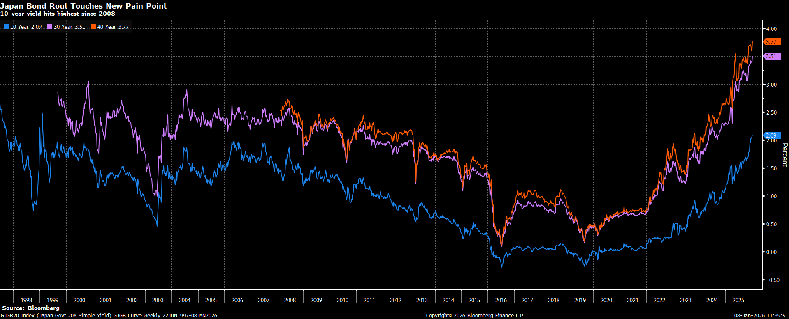

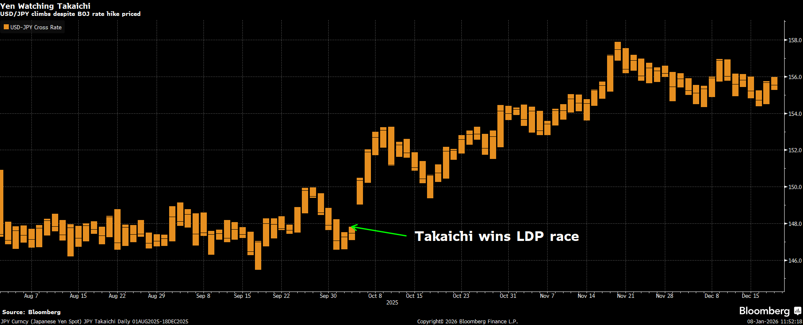

This is why BOJ normalization should not be equated with a clean, one-way yen bull market. The path is likely to
be two-way and policy-managed: allowed to strengthen at times, but not allowed to accelerate into levels that
threaten exports, corporate earnings translation, or political optics. For investors, the correct expression is rarely a
spot “hero trade.” In a regime where the yen’s behavior is increasingly state-contingent, convexity matters.
Options and structured exposures tend to dominate outright positioning — not because the direction is
unknowable, but because the timing and stop-outs are where P&L goes to die. And as history reminds us, Japan is
very good at teaching that lesson.

Against this backdrop, levels still matter. Even under a Takaichi-led policy regime, a yen approaching 160 would
likely be politically and socially intolerable. At those levels, currency weakness feeds directly into imported
inflation, energy costs, and household purchasing power — pressures that fiscal expansion or nationalist framing
cannot fully offset. History is clear: the BOJ and Ministry of Finance have repeatedly intervened in the 155–160
zone once depreciation shifts from export support to domestic instability. We therefore continue to view ~160 as
an asymmetric entry point for long JPY exposure, not as a structural turning point, but as the level at which the
policy reaction function becomes active.

BOJ Has Repeatedly Intervened in the 155–160 Zone, Source: GS

Looking into 2026, our base case is slow, managed yen appreciation, not a sharp revaluation. The yen is likely to
remain weak by historical standards, but is unlikely to be allowed to weaken materially beyond current extremes.
In this regime, the optimal expression is not outright direction but volatility harvesting. Selling yen volatility —
particularly structures that benefit from range-bound weakness capped near 160 — remains attractive. Japan
tolerates depreciation, but intervenes before it becomes politically costly. This is a market that rewards patience,
convexity, and respect for policy control.

Equities – From Global Beta to Security-State Alpha

Japan equities have historically been priced as global beta with domestic seasoning: a high-quality market that
rallied when global liquidity was abundant and underperformed when the yen strengthened or global growth
rolled over. In that framework, the biggest driver was rarely Tokyo — it was the Fed, global PMI, and USDJPY.

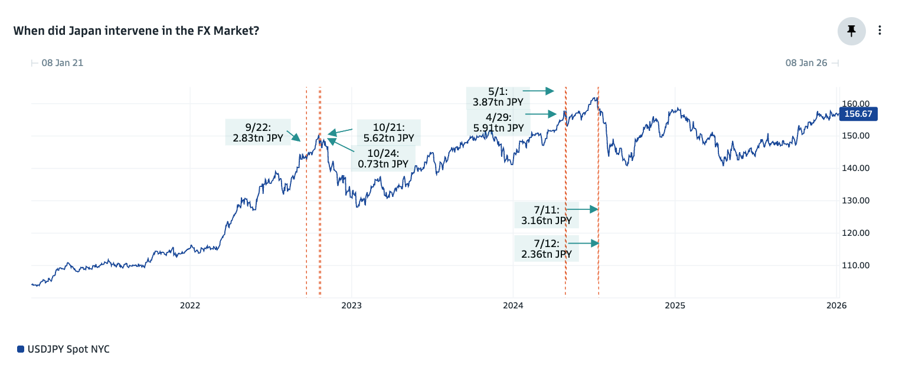

Japan Equities Have Historically Traded as Global Beta to U.S. Risk Assets, Source: Bloomberg

A Takaichi-era regime introduces a more domestic policy-driven equity map. When fiscal and security priorities
become first-order macro variables, equity performance starts to fragment into policy-aligned winners versus
globalization-exposed losers. The market begins to care less about Japan as a “cheap developed market with
governance reforms” and more about Japan as an economy channeling capital toward strategic autonomy —
defense, energy security, supply chain resilience, and national capex programs with budget visibility. In other
words: what was once a single beta trade increasingly contains pockets of alpha.

That does not mean the whole market rerates structurally overnight. Without sustained nominal growth, broad
index upside still faces the familiar constraint: earnings growth must be real, not purely multiple expansion. But it
does mean leadership can become more durable in the parts of the market that sit closest to the policy impulse —
where order books are visible, spending is sticky, and political commitment is persistent. Conversely, exporters and
price-taking manufacturers that relied on the old “weak yen solves everything” assumption may find themselves
priced with a higher discount rate, especially if yen strength becomes episodically disruptive and trade
relationships become more politicized.

In practical terms, this shifts our sectoral preferences. We favor defense, where Takaichi’s push to reinterpret
constitutional constraints and lift defense spending toward NATO-style GDP targets creates a rare combination of
political will, budget visibility, and multi-year demand. We also favor semiconductors, supported both by the AI
capex cycle and by the U.S.-led effort to secure Western-aligned supply chains, where Japan offers a higher-
security alternative to Taiwan risk. Finally, banks stand out as a structural beneficiary: even a slow and cautious
BOJ normalization improves net interest margins at the margin, while clearer policy direction enables balance-
sheet expansion after decades of constraint. Together, these sectors sit at the intersection of policy intent, capital
allocation, and earnings durability — precisely where Japan’s equity alpha is likely to reside in a security-state
regime.

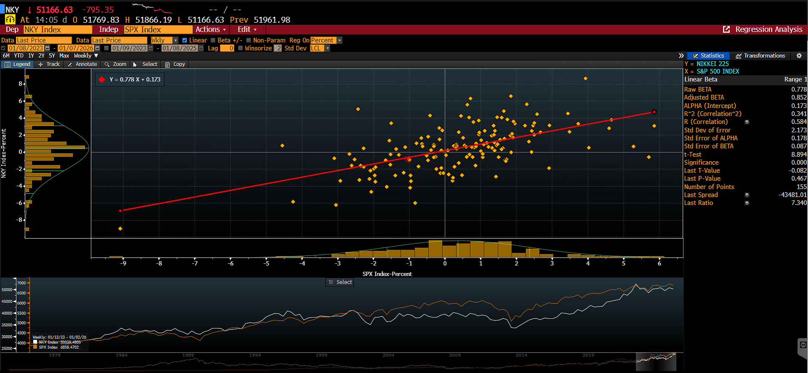

Japan as a High-security Node in Western Semiconductor Supply Chains, Source: EPRS

香港干诺道中111 号

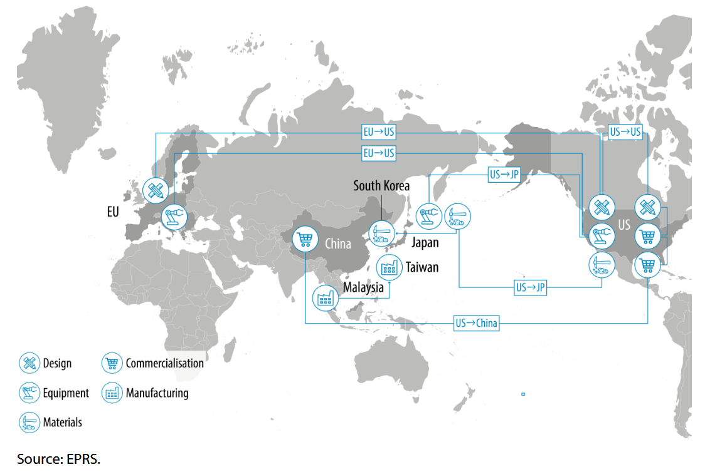
