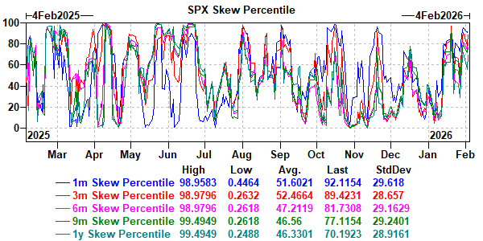

# My Note | Broad Risk Sell-Off — What’s Actually Driving It

---

## 1. Macro (What changed at the top-down level?)

- **Very little has changed macro-wise.**
- No material deterioration in **growth, inflation, or policy expectations**.
- Rates broadly stable; **no disorderly tightening of financial conditions**.
- Geopolitical noise (e.g. Middle East headlines) acted as a **volatility accelerant**, not a root cause.
- This is **not** a macro recession or policy-driven risk-off.

**My read:**  
**Macro is not the driver** — it’s *permissive, not causal*.

---

## 2. Fundamentals (Earnings / growth / real economy)

- **Earnings trends remain intact**; no broad downgrade cycle.
- Even in tech, weakness is driven by **valuation sensitivity and capex uncertainty**, *not earnings misses*.
- Outside equities:
  - **Crypto and precious metals selling** confirms *risk compression*, not a fundamental reassessment.
  - No demand-shock narrative emerging.

**My read:**  
**Fundamentals did not break; pricing did.**

---

## 3. Positioning & Flows (The real engine of the move)

- **Momentum drawdown ~10%** — among the largest in years.

- Positioning had become **extreme**:
  - Crowded longs in **high-beta, high-vol winners**.
  - **Systematic and discretionary risk stacked** in the same direction.
- Flow dynamics:
  - **De-grossing and de-risking**, rather than outright panic selling.
  - HFs and LOs both net sellers; flows **broad-based** across equities, crypto, and commodities.
  - CTA and vol-target strategies likely contributed as **short-term trend signals rolled**.
- Vol markets:
  - **Front-end vol bid aggressively**; downside skew steepened.
  - Dealer gamma **close to flipping short** — increasing sensitivity to further downside.

**My read:**  
**This is a positioning clean-up, not a discretionary exit.**

---

## 4. Behavioral & Market Microstructure

- **Classic late-cycle momentum behavior**:
  - Strong YTD performance → rising narrative confidence → **crowded exposure**.
- As volatility picked up:
  - **Correlations rose**.
  - **Tail hedging demand increased**.
  - Liquidity thinned, **amplifying moves**.
- Importantly:
  - **No capitulation yet**.
  - Breadth remains healthy; **equal-weight indices outperforming**.
  - This looks like **compression of excess**, not fear exhaustion.

**My read:**  
This is an **orderly unwind so far** — *dangerous precisely because it isn’t panicky yet*.

---

## 5. Cross-Asset Signal Check

- **Equities, crypto, metals all down** → portfolio-level risk reduction.
- USD stable; rates **not signaling systemic stress**.
- Confirms a **risk-budget reset**, not a macro shock.

---

## 6. What We’re Watching From Here

- Signs of **true capitulation**:
  - Indiscriminate selling.
  - Forced deleveraging.
  - Vol spiking *beyond* realized.
- Dealer gamma positioning:
  - **Sustained negative gamma would exacerbate drawdowns**.
- Whether prior winners **stabilize without immediate re-crowding**.

---

## My Bottom Line

- **This is a volatility + positioning event**, not a macro or fundamental one.
- **Short-term caution still warranted** — downside tails remain active.
- **Medium-term**, momentum drawdowns are often opportunities — *but only after excess risk is cleared*.
