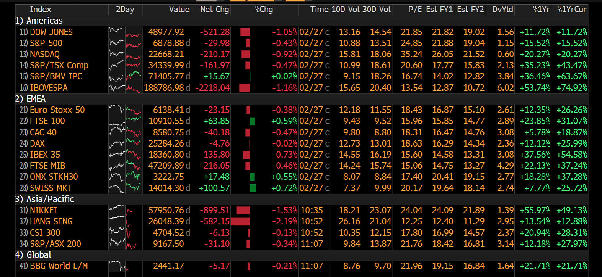

# First Take After Monday Opens

*Mar 2, 2026 · 10:00 AM HKT*

---

## Snapshot

Over the weekend, the U.S. and Israel formally entered into conflict with Iran. Iran’s Supreme Leader Ayatollah Khamenei was reportedly killed in an attack, and tensions have escalated into a standoff. The Strait of Hormuz (which accounts for roughly 20% of global oil and natural gas exports) has been temporarily closed, raising concerns over energy supply disruption.

As of this morning, the initial market reaction has been risk-off:
- **Gold, crude oil, and defense-related stocks** have rallied.
- **Safe-haven FX** moved higher (**JPY** and **USD** up moderately, **CHF** leading gains).
- **Risk assets** are under pressure (**Hang Seng -2.3%**, **Nikkei -1.6%**, **Nasdaq futures -1%**), but I have not seen panic selling at this stage.

---

## Near-Term Read

Markets are repricing geopolitical risk premium. The key variables to monitor are whether oil can sustain elevated levels and whether shipping routes are genuinely disrupted. If supply is not materially and persistently affected, this is more likely to be a one-off risk event rather than a prolonged war.

Given the current U.S. political cycle, sustained oil price spikes would push up inflation expectations and weigh on Trump’s election prospects. I therefore believe there are strong incentives for de-escalation.

---

## Core Themes (Reiterated)

Earlier this year, I outlined my core investment themes: **gold, defense, and AI (power infrastructure and upstream supply chain)** as medium- to long-term structural directions.

- **Gold & defense:** Both have been driven higher by safe-haven demand. Short-term positioning appears elevated, and I do not recommend chasing. If tensions ease and prices pull back, that would provide a better entry opportunity.
- **Energy:** Geopolitical premium has risen, but if supply disruption proves temporary, oil may retrace after the initial spike.
- **AI & tech:** Short-term volatility is likely as risk appetite softens. However, the structural productivity gains and cash flow monetization from AI remain intact. If high-quality leaders correct meaningfully, I recommend accumulating in tranches on weakness.
- **Bitcoin:** Currently trading around **66,000**. It continues to behave primarily as a liquidity- and sentiment-driven asset. Near-term volatility is expected, while the longer-term direction remains dependent on USD trends and global liquidity conditions.

---

## Overall Strategy

I do not suggest chasing defensive assets at current levels. Risk assets may present selective dip-buying opportunities once emotional pricing stabilizes. I prefer to wait for the first wave of repricing to settle before positioning more actively.
